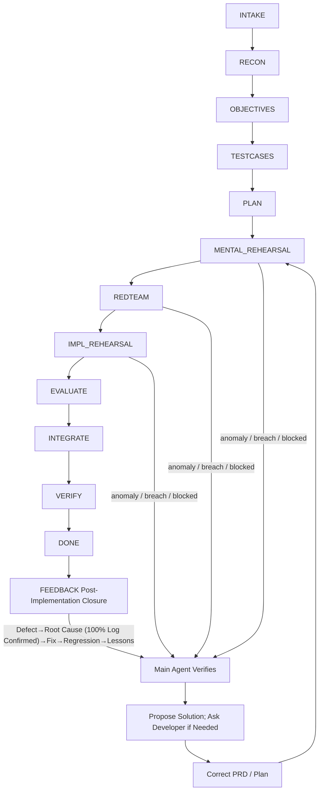

# Sandtable · Sandbox Deduction-Driven Development

> A methodological plugin for coding agents: Recon first, define objectives, write test cases, perform deduction, then implement. Shifts from "start coding directly" to "expose anomalies first, close the plan loop first".

- **Deduce before implementation**: Expose logical flaws and implementation weak points first, then decide whether to proceed with actual changes.
- **Persistent trace in `docs/sandtable/`**: Objectives, plans, status, and decisions are persisted to disk, allowing seamless continuation across personnel changes, AI switches, or abnormal exits.
- **Correct upon anomaly**: Once `ANOMALY_FOUND`, `BREACH_FOUND`, or `BLOCKED` occurs, immediately rewrite documentation, correct the plan, and rehearse again. Never force-push with bad assumptions.
- **This repository is bootstrapping itself**: Sandtable uses this exact methodology to refine its own `README`, commands, and skills. Each deduction round rewrites `docs/sandtable/`, tightening the methodology alongside practice.

**Try it now**: No need to manually clone. Send one of the following official prompts **verbatim** to your AI (works with Cursor / Claude Code / Codex / Kiro / other general coding agents). The AI will select the installation language based on the prompt text and read the same `INSTALL.md` to complete the installation.

Chinese:

> Read https://github.com/andoop/sandtable/blob/main/INSTALL.md and install Sandtable into the current project following Chinese instructions.

English:

> Read https://github.com/andoop/sandtable/blob/main/INSTALL.md and use it to install Sandtable into the current project in English.

After installation, access Sandtable commands via your tool: Cursor uses `.cursor/commands`, Codex uses the Sandtable Codex plugin/commands, and Claude Code / Kiro / general agents can directly send the command name as a message to the AI for execution. See [`Quickstart`](#quickstart) for details.



Plain English: First, fully understand the requirements, then lock down the objectives, test cases, and plans. Use mental rehearsal, red-blue wargaming, and implementation rehearsal to layer-by-layer find weak points. If an anomaly occurs, the main agent verifies it first and proposes a solution; asks the developer if necessary, rewrites the PRD or plan, and then re-enters the rehearsal phase.

[Compare with Superpowers](#sandtable-vs-superpowers) · [Try it now](#quickstart)

## Why Sandtable
One word: **Deduction**. In war, you don't use real lives for trial and error; you run the battle through a sandbox multiple times first. Changing code is the same: fully deduce the plan before implementation.

Sandtable enables agents to force out weak points layer by layer using three types of deduction, with the entire process persisted to disk and resumable:

- **Mental Rehearsal**: Read-only logic deduction, asking "Does this plan actually work?"
- **Red-Blue Wargaming**: The Red Team (OPFOR) specializes in finding **reproducible kill shots**, asking "Can it be broken?"
- **Implementation Rehearsal**: Actually modify code across multiple isolated worktrees, asking "Is the output correct?", then review and select the best.

> If any of the three deductions find an anomaly, stop immediately, rewrite documentation, correct the plan, and rehearse again—weak points are exposed before implementation, not after deployment.

## Bootstrap Proof
This is not a documentation repo written for others to simply follow. This very repository records feature objectives, tests, plans, deductions, and rollback corrections in `docs/sandtable/`, using the same methodology to continuously refine its `README`, commands, and skills.

## Quickstart
1. No need to clone this repo. Send one of the following official prompts **verbatim** to your AI, letting it read the unified installation guide and install the corresponding local assets in the language of the prompt:

   Chinese:

   > Read https://github.com/andoop/sandtable/blob/main/INSTALL.md and install Sandtable into the current project following Chinese instructions.

   English:

   > Read https://github.com/andoop/sandtable/blob/main/INSTALL.md and use it to install Sandtable into the current project in English.

2. Complete the final wiring based on the AI's installation result; if it prompts you to reload the window, reopen the workspace, or enable a local plugin for rules to take effect, follow the instructions.
3. Choose the command entry point based on your tool:
   - Cursor: Provides slash commands via `.cursor/commands`, use `/sandtable-start` to begin.
   - Codex: Provides a local Sandtable plugin via `plugins/sandtable` and `.agents/plugins/marketplace.json`; after registering/enabling with `codex plugin marketplace add "$PWD"` and `codex plugin add sandtable --marketplace sandtable-local`, try `/sandtable:sandtable-start` first. Whether the current Codex version shows local plugin commands in the `/` menu depends on client capabilities; do not assume Codex guarantees Cursor's bare slash auto-completions.
   - Claude Code / Kiro / General agents: Without dedicated slash wiring, send `/sandtable-start` as a regular message to the AI, letting it execute according to `AGENTS.md` and `commands/sandtable-start.md`.

Manual installation, differences across AI tools (Cursor / Claude Code / Codex / Kiro, etc.), and local trial paths are all documented in `INSTALL.md` and are not expanded here. `.cursor/commands` only serves Cursor; Codex command entry points come from the Sandtable Codex plugin and do not promise auto-discovery of Cursor commands.

## Updates (For Installed Users)
To upgrade an existing Sandtable project to the latest methodological assets, send one of the following official prompts **verbatim** to your AI (symmetrical to installation; updates only overwrite methodological assets, **never touching** your `docs/sandtable/` campaign memory, and automatically backup to `.sandtable-backup/` before overwriting):

Chinese:

> Read https://github.com/andoop/sandtable/blob/main/UPDATE.md and update the installed Sandtable in the current project to the latest version following Chinese instructions.

English:

> Read https://github.com/andoop/sandtable/blob/main/UPDATE.md and use it to update the already-installed Sandtable in the current project to the latest, in English.

Details in [`UPDATE.md`](UPDATE.md). Note: **Re-running the installation prompt will not update** (the installer skips if already exists); please use the same language as installation for updates.

## Command Entry Points
- `/sandtable-start`: Enter the first five steps from a one-sentence requirement, converging on recon, objectives, test cases, and plans.
- `/sandtable-autopilot`: Auto-advance with minimum coverage, and autonomously judge whether to append or evaluate `RECON -> ... -> EVALUATE` after meeting criteria; stops only on true blocks.
- `/sandtable-mental`: Read-only logic deduction loop.
- `/sandtable-redteam`: Red Team OPFOR finds reproducible weak points.
- `/sandtable-live`: Conduct implementation rehearsal in isolated worktrees.
- `/sandtable-debrief`: Score and select the best from multiple implementation rehearsals.
- `/sandtable-rehearse`: Chains map exercises, red-blue wargaming, implementation rehearsal, and debriefing.
- `/sandtable-bug`: Accepts acceptance feedback, logs to `feedback.md`, and triages (post-implementation closure entry).
- `/sandtable-bugfix`: Evidence-driven root cause repair (bugfix mode; root cause must be 100% confirmed via logs).
- `/sandtable-resume`: Restore context and continue based on `state.md` and `journal.md`.
- `/sandtable-status`: View phases, tasks, deduction results, and pending issues.

## Sandtable vs Superpowers
[Superpowers](https://github.com/obra/superpowers) is an excellent, widely-used agent methodology. Sandtable shares the same lineage: neither lets agents "start coding upon seeing a requirement," both use auto-triggered skills, both work in isolated worktrees, and both persist designs to disk.

The one-sentence difference: **Superpowers' metaphor is "giving the agent superpowers"—think clearly first, then write the code correctly using the TDD red-green-refactor cycle; Sandtable's metaphor is "wargaming on a sandbox before battle"—fight the battle on paper first, force out weak points before landing, then deploy the optimal strategy.** One focuses on "writing the code correctly," the other on "breaking through the plan."

| Dimension | 🦸 Superpowers | 🪖 Sandtable |
| --- | --- | --- |
| **Core Metaphor** | Skill library that gives agents superpowers | Sandbox / wargame deduction before implementation |
| **Requirement Convergence** | `brainstorming` Socratic questioning, producing a design doc | `RECON` recon + `OBJECTIVES` red lines (MUST/MUST-NOT) + `TESTCASES` black-box cases, turning "AI thinks it understands" into a human-verifiable gate |
| **Quality Assurance** | In-process & post: TDD red-green-refactor + `requesting-code-review` inter-task review | Pre-implementation: Mental rehearsal checks logic flow, `REDTEAM` OPFOR specializes in finding **reproducible kill shots**, exposing weak points before coding begins |
| **Isolated Execution** | `using-git-worktrees` + `subagent-driven-development` advances task-by-task in a single pipeline | Implementation rehearsals **run the same requirement in parallel across multiple isolated worktrees**, then `/sandtable-debrief` scores to **select the best (best-of-N)** |
| **Process Traceability** | Design docs stored in `docs/superpowers/specs/` | Full state machine persisted in `docs/sandtable/`: objectives, test cases, plans, `state.md`, `journal.md`, `questions.md` |
| **Resumable on Interruption?** | Homepage does not highlight interruption recovery as a core feature | `/sandtable-resume` resumes based on disk state; continues seamlessly across personnel changes, AI switches, or abnormal exits without relying on chat history |
| **Anomaly Handling** | Review/tests find issues, then fix | Any deduction yelling `ANOMALY_FOUND` / `BREACH_FOUND` / `BLOCKED` immediately terminates, rewrites docs, corrects the plan, and re-rehearses |

**How to choose**: If you want a mature, widely-adopted, TDD-disciplined general methodology, choose Superpowers. If requirements are vague, changes are high-risk, the cost of mistakes is high, and you want to "fight the battle on the sandbox first with a traceable, resumable process"—Sandtable's deduction loop was built for exactly this. They are not mutually exclusive: Superpowers writes the code correctly, Sandtable breaks through the plan.

## Directory Structure
```text
sandtable/
  README.md
  AGENTS.md / CLAUDE.md
  .cursor/rules/sandtable.mdc
  .cursor/commands/*.md
  commands/*.md
  .agents/plugins/marketplace.json
  plugins/sandtable/
    .codex-plugin/plugin.json
    commands/*.md
    skills/**
  hooks/
  skills/
    autonomous-orchestration/
    mental-rehearsal/
    red-team-wargame/
    implementation-rehearsal/
    state-and-memory/
    ... more skills
  templates/
```

At runtime, it generates in the target project:

```text
docs/sandtable/
  project.md
  constraints.md
  features/<date-slug>/
    prd.md  tests.md  plan.md  state.md  journal.md  questions.md
    rehearsals/
```

## Four Bottom Lines
1. **No guessing, no fabrication**: If unclear, read code, read docs, ask the developer first.
2. **Think before acting**: Assumptions must be explicitly stated, multiple solutions must be laid out.
3. **Surgical changes**: No safety nets, no scope creep, every line traceable to a requirement.
4. **Goal-driven**: Every step must map to verifiable success criteria.

## License
MIT
