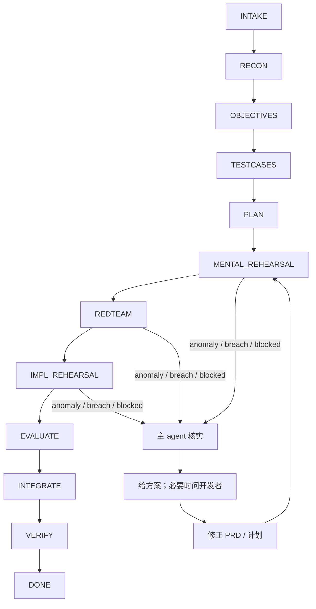

# Sandtable · 沙盘推演驱动开发

> 给 coding agent 的方法论插件: 先侦察、定目标、写用例、做推演，再落地实现，把“直接开写”改成“异常先暴露、计划先闭环”。

- **先推演再落地**: 先把逻辑漏洞和实现破口暴露出来，再决定是否进入真实改动。
- **`docs/sandtable/` 持久留痕**: 目标、计划、状态和裁决落盘，换人、换 AI、异常退出都能续上。
- **推演会反过来改进方法论**: 每轮异常和攻破都会回写 `docs/sandtable/`，这个仓库会随着演练一起收紧。
- **异常即回修正**: 一旦出现 `ANOMALY_FOUND`、`BREACH_FOUND` 或 `BLOCKED`，就先回写文档，不带着坏假设硬推。
- **这个仓库正在自举**: 当前仓库自己就在用 Sandtable 打磨 `README`、命令和 skill。

立刻试用: 把这句话发给你的 AI: “阅读 https://github.com/andoop/sandtable/blob/main/INSTALL.md，并据此把 Sandtable 安装进当前项目。” 安装完成后运行 `/sandtable-start`。见 [`Quickstart`](#quickstart)。



白话说法: 先把需求摸清，再把目标、用例和计划写死，然后用头脑预演、红蓝对抗、实现预演逐层找破口。只要出现异常，就先由主 agent 核实，给出方案；必要时问开发者，再回写 PRD 或计划，然后重新进入预演。

在 superpowers 的首页里，`using-git-worktrees` 被明确列出。Sandtable 的前两屏先让你看到 `docs/sandtable/`。

[看对比](#sandtable-vs-superpowers) · [立刻试用](#quickstart)

## Why Sandtable
- `TESTCASES` 先把“AI 以为自己懂了”变成人能核对的黑盒场景，减少需求理解漂移。
- `REDTEAM` 专门攻击计划或实现，先找可复现杀招，再决定是否继续推进。
- `state.md` 和 `journal.md` 把当前阶段、任务和裁决写回磁盘，接防时不是靠聊天记录猜进度。
- `/sandtable-resume` 直接按 `project.md`、`state.md`、`journal.md` 恢复现场，不用从头再讲一遍背景。

## 自举证明
这个仓库不是“写给别人照做”的文档仓。当前仓库自己就在 `docs/sandtable/` 里记录 feature 目标、测试、计划、推演和回退修正，用同一套方法继续打磨 `README`、命令和 skill。

## Quickstart
1. 把这句话发给你的 AI：
   > 阅读 [INSTALL.md](https://github.com/andoop/sandtable/blob/main/INSTALL.md)，并据此把 Sandtable 安装进当前项目。
2. 按 AI 的安装结果完成最后接线；若它提示重载窗口或重开工作区以使规则生效，就照做。
3. 第一条命令：`/sandtable-start`

手工接线、受保护追加、或本地试用路径都保留在 `INSTALL.md`，README 不再展开 harness 分支。

## 命令入口
- `/sandtable-start`: 从一句话需求进入前五步，收束到侦察、目标、用例和计划。
- `/sandtable-autopilot`: 按配额自动推进 `RECON -> ... -> EVALUATE`，真阻塞才停。
- `/sandtable-mental`: 只读推演逻辑闭环。
- `/sandtable-redteam`: 红军 OPFOR 找可复现破口。
- `/sandtable-live`: 在隔离 worktree 做实现预演。
- `/sandtable-debrief`: 给多个实现预演打分择优。
- `/sandtable-rehearse`: 串联图上作业、红蓝对抗、实现预演和复盘。
- `/sandtable-resume`: 按 `state.md` 与 `journal.md` 恢复现场继续。
- `/sandtable-status`: 查看阶段、任务、推演结果和未决问题。

## Sandtable vs Superpowers
- 在 superpowers 的 README 里，`brainstorming` 被明确列出。在 Sandtable 的首页里，`TESTCASES` 被明确列出。
- 在 superpowers 的 README 里，`requesting-code-review` 被明确列出。在 Sandtable 的首页里，`REDTEAM` 被明确列出。
- 在 superpowers 的 README 里，`using-git-worktrees` 被明确列出。在 Sandtable 的首页里，`docs/sandtable/` 被明确列出。

## 目录结构
```text
sandtable/
  README.md
  AGENTS.md / CLAUDE.md
  .cursor/rules/sandtable.mdc
  .cursor/commands/*.md
  commands/*.md
  hooks/
  skills/
    autonomous-orchestration/
    mental-rehearsal/
    red-team-wargame/
    implementation-rehearsal/
    state-and-memory/
    ... more skills
  templates/
```

运行时会在目标项目生成:

```text
docs/sandtable/
  project.md
  constraints.md
  features/<date-slug>/
    prd.md  tests.md  plan.md  state.md  journal.md  questions.md
    rehearsals/
```

## 四条底线
1. **不猜测、不捏造**: 不清楚的事先读代码、读文档、问开发者。
2. **先思考再动手**: 假设要显式写出，多解要摆出来。
3. **外科手术式改动**: 不兜底、不节外生枝、每行都可追溯到需求。
4. **目标驱动**: 每一步都要能映射到可验证的成功标准。

## License
MIT
