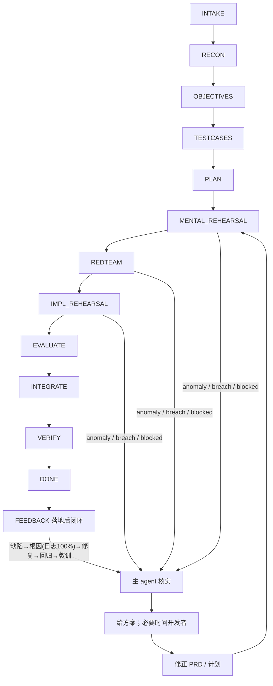

# Sandtable · 沙盘推演驱动开发

> 给 coding agent 的方法论插件: 先侦察、定目标、写用例、做推演，再落地实现，把“直接开写”改成“异常先暴露、计划先闭环”。

- **先推演再落地**: 先把逻辑漏洞和实现破口暴露出来，再决定是否进入真实改动。
- **`docs/sandtable/` 持久留痕**: 目标、计划、状态和裁决落盘，换人、换 AI、异常退出都能续上。
- **异常即回修正**: 一旦出现 `ANOMALY_FOUND`、`BREACH_FOUND` 或 `BLOCKED`，就先回写文档、修正计划再重演，绝不带着坏假设硬推。
- **这个仓库正在自举**: Sandtable 自己就用同一套方法打磨 `README`、命令和 skill，每轮推演都回写 `docs/sandtable/`，让方法论随演练一起收紧。

**立刻试用**: 无需手动 clone，把下面两条官方提示词之一**原样**发给你的 AI（Cursor / Claude Code / Codex / Kiro / 其它通用 coding agent 均可）。AI 必须按你贴过去的这条提示词正文选择安装语言，并读取同一个 `INSTALL.md` 完成安装。

中文版：

> 阅读 https://github.com/andoop/sandtable/blob/remote/INSTALL.md ，并据此按中文把 Sandtable 安装进当前项目。

English:

> Read https://github.com/andoop/sandtable/blob/remote/INSTALL.md and use it to install Sandtable into the current project in English.

安装完成后按你的工具进入 Sandtable 命令：Cursor 使用 `.cursor/commands`，Codex 使用 Sandtable Codex plugin/commands，Kiro CLI 使用 `.kiro/prompts`（`/prompts sandtable-start` 或 `@sandtable-start`），Claude Code / 其它通用 agent 可直接把命令名作为消息发给 AI 执行。详见 [`Quickstart`](#quickstart)。



白话说法: 先把需求摸清，再把目标、用例和计划写死，然后用头脑预演、红蓝对抗、实现预演逐层找破口。只要出现异常，就先由主 agent 核实，给出方案；必要时问开发者，再回写 PRD 或计划，然后重新进入预演。

[看与 Superpowers 的对比](#sandtable-vs-superpowers) · [立刻试用](#quickstart)

## Why Sandtable
一个词：**推演**。打仗不会拿真人命去试错，先在沙盘上把仗打几遍；改代码也一样，落地前先把方案推演穿。

Sandtable 让 agent 用三种推演逐层逼出破口，全程落盘可续：

- **头脑预演**：只读推演逻辑，问“这套方案到底通不通”。
- **红蓝对抗**：红军 OPFOR 专攻找**可复现杀招**，问“能不能被打破”。
- **实现预演**：多个隔离 worktree 真改代码，问“做出来对不对”，再复盘择优。

> 三种推演任一发现异常，立即停、回写文档、修正计划、再重演——破口在落地前暴露，而不是上线后炸。

## 自举证明
这个仓库不是“写给别人照做”的文档仓。当前仓库自己就在 `docs/sandtable/` 里记录 feature 目标、测试、计划、推演和回退修正，用同一套方法继续打磨 `README`、命令和 skill。

## Quickstart
1. 无需 clone 本仓库，把下面两条官方提示词之一**原样**发给你的 AI，让它自己去读统一的安装说明并按该提示词语言安装对应本地资产：

   中文：

   > 阅读 https://github.com/andoop/sandtable/blob/remote/INSTALL.md ，并据此按中文把 Sandtable 安装进当前项目。

   English:

   > Read https://github.com/andoop/sandtable/blob/remote/INSTALL.md and use it to install Sandtable into the current project in English.

2. 按 AI 的安装结果完成最后接线；若它提示重载窗口、重开工作区或启用本地插件以使规则生效，就照做。
3. 按工具选择命令入口：
   - Cursor：通过 `.cursor/commands` 提供 slash 命令，使用 `/sandtable-start` 开始。
   - Codex：通过 `plugins/sandtable` 与 `.agents/plugins/marketplace.json` 提供本地 Sandtable plugin（先用 `codex plugin marketplace add "$PWD"` 和 `codex plugin add sandtable --marketplace sandtable-local` 注册/启用）。Codex 插件暴露的是 **skills**（用 `$技能名` 触发，不是斜杠命令）：用 `$using-sandtable` 作为总入口驱动整个流程，移动端用 `$mobile-companion`。`/sandtable-*` 斜杠命令是 Cursor/Claude/Kiro 的入口，别当作 Codex 的保证。
   - Kiro CLI：通过 `.kiro/prompts/*.md` 提供命令入口，用 `/prompts sandtable-start` 或 `@sandtable-start`（`@` + Tab 补全）触发；`.kiro/steering/sandtable.md`（始终加载的精简方法论基线，完整方法论按需读 `skills/`）作为默认 agent 的行为基线。新增 prompts/steering 后需重开会话生效。
   - Claude Code / 其它通用 agent：没有专属 slash 接线时，把 `/sandtable-start` 作为普通消息发给 AI，让它按 `AGENTS.md` 与 `commands/sandtable-start.md` 执行。

手工安装、不同 AI 工具（Cursor / Claude Code / Codex / Kiro 等）的差异、以及本地试用路径，都写在 `INSTALL.md`，README 不再展开。`.cursor/commands` 只服务 Cursor；Codex 的命令入口来自 Sandtable Codex plugin，不承诺自动发现 Cursor 命令。

## 更新（已安装用户）
已安装 Sandtable 的项目要升级到最新方法论资产，把下面官方提示词之一**原样**发给你的 AI（与安装对称；更新只覆盖方法论资产，**绝不触碰**你的 `docs/sandtable/` 战役记忆，覆盖前自动备份到 `.sandtable-backup/`）：

中文：

> 阅读 https://github.com/andoop/sandtable/blob/remote/UPDATE.md ，并据此按中文把当前项目里已安装的 Sandtable 更新到最新。

English：

> Read https://github.com/andoop/sandtable/blob/remote/UPDATE.md and use it to update the already-installed Sandtable in the current project to the latest, in English.

细节见 [`UPDATE.md`](UPDATE.md)。注意：**重跑安装提示词无法更新**（安装器"已存在即跳过"）；请用与安装时相同的语言更新。

## 命令入口
- `/sandtable-start`: 从一句话需求进入前五步，收束到侦察、目标、用例和计划。
- `/sandtable-autopilot`: 按最低覆盖自动推进，并在达标后自主判断是否追加或评估 `RECON -> ... -> EVALUATE`，真阻塞才停。
- `/sandtable-mental`: 只读推演逻辑闭环。
- `/sandtable-redteam`: 红军 OPFOR 找可复现破口。
- `/sandtable-live`: 在隔离 worktree 做实现预演。
- `/sandtable-debrief`: 给多个实现预演打分择优。
- `/sandtable-rehearse`: 串联图上作业、红蓝对抗、实现预演和复盘。
- `/sandtable-bug`: 受理验收反馈，落 `feedback.md` 并分诊（落地后闭环入口）。
- `/sandtable-bugfix`: 证据驱动根因修障（bugfix 模式，根因必靠日志100%确认）。
- `/sandtable-resume`: 按 `state.md` 与 `journal.md` 恢复现场继续。
- `/sandtable-status`: 查看阶段、任务、推演结果和未决问题。

可选 Mobile Review Companion 命令（需先按下文启用 runtime）：

- `/sandtable-mobile-start`: 按需开启手机同步，生成 4 位配对码与 Server URL，并拉起 inbox 等待子 agent。
- `/sandtable-mobile-status`: 查看手机同步状态、配对码、是否已配对。
- `/sandtable-mobile-stop`: 终止手机同步并停止 runtime server。
- `/sandtable-mobile-wait`: 启动单职责 inbox 等待子 agent（等到一条手机消息即交给主 agent 并退出）。

## Mobile Review Companion（可选）

Sandtable 现在包含一个可选 mobile review runtime：本机/局域网 server、MCP 风格 handler、文件信箱 fallback、长驻 waiting worker 队列，以及 Android/iOS Flutter App。它用于在手机上查看 PRD/tests/plan/state/journal/questions，并提交确认或回答。

默认 Sandtable 方法论安装仍不安装 Node、Flutter、Dart 运行时或 npm/pub 依赖。安装/更新会**复制并覆盖 `runtime/`（Node server）源码**（排除 `node_modules/`、`dist/`、`.vite/` 等依赖与构建产物），让 `/sandtable-mobile-*` 命令开箱即用；但 **`apps/`（Flutter App）不随方法论安装**，需用户单独 clone 本仓库取得。要启用移动端审阅，先 `npm --prefix runtime/server install` 安装依赖，再按 [`docs/mobile-review-companion/runtime.md`](docs/mobile-review-companion/runtime.md) 启动；协议与真机验证分别见 [`protocol.md`](docs/mobile-review-companion/protocol.md) 与 [`verification.md`](docs/mobile-review-companion/verification.md)。

安装/更新方法论资产时会带上 `/sandtable-mobile-*` 命令、`scripts/sandtable-mobile-*.sh` 与 `runtime/` server 源码；这些就绪后，移动端命令即可在本机启动 server（首次需先装一次 npm 依赖）。

## Sandtable vs Superpowers
[Superpowers](https://github.com/obra/superpowers) 是一套优秀的、被广泛使用的 agent 方法论，Sandtable 与它同源同宗：都不让 agent“看见需求就开写”，都用自动触发的 skill、都在隔离 worktree 里干活、都把设计落盘。

一句话区别：**Superpowers 的隐喻是“给 agent 装上超能力”，先想清楚、再用 TDD 红绿灯把代码写对；Sandtable 的隐喻是“打仗前先在沙盘上推演”，先把仗在图上打几遍、把破口在落地前逼出来，再择优出兵。** 一个偏“把代码写对”，一个偏“把方案打穿”。

| 维度 | 🦸 Superpowers | 🪖 Sandtable |
| --- | --- | --- |
| **核心隐喻** | 给 agent 装上超能力的技能库 | 落地前的沙盘 / 兵棋推演 |
| **需求收敛** | `brainstorming` 苏格拉底式追问，产出 design doc | `RECON` 侦察 + `OBJECTIVES` 红线（MUST/MUST-NOT）+ `TESTCASES` 黑盒用例，把“AI 以为自己懂了”变成人能核对的闸门 |
| **质量怎么保证** | 事中事后：TDD 红绿重构 + `requesting-code-review` 任务间评审 | 落地前置：头脑预演问逻辑通不通、`REDTEAM` 红军 OPFOR 专攻找**可复现杀招**，破口在写代码前就暴露 |
| **隔离执行** | `using-git-worktrees` + `subagent-driven-development` 单条流水线逐任务推进 | 实现预演在多个隔离 worktree **并行跑同一需求**，再 `/sandtable-debrief` 打分**择优（best-of-N）** |
| **过程留痕** | 设计文档存 `docs/superpowers/specs/` | 整条状态机落盘 `docs/sandtable/`：目标、用例、计划、`state.md`、`journal.md`、`questions.md` |
| **断了能续吗** | 首页未把中断恢复作为核心卖点 | `/sandtable-resume` 按磁盘状态接防，换人、换 AI、异常退出都能续上，不靠翻聊天记录 |
| **异常如何处理** | 评审/测试发现问题再修 | 任一推演喊出 `ANOMALY_FOUND` / `BREACH_FOUND` / `BLOCKED` 立即终止，回写文档、修正计划，再重演 |

**怎么选**：想要一套成熟、社区庞大、强 TDD 纪律的通用方法论，选 Superpowers。需求模糊、改动高危、一旦做错代价大、且希望“先把仗在沙盘上打穿、过程可追溯可续接”——Sandtable 的推演闭环正是为此而生。两者并不互斥：Superpowers 把代码写对，Sandtable 把方案打穿。

## 目录结构
```text
sandtable/
  README.md
  INSTALL.md / UPDATE.md
  AGENTS.md / CLAUDE.md
  .cursor/rules/sandtable.mdc
  .cursor/commands/*.md
  .kiro/prompts/*.md                 # Kiro CLI 命令入口（/prompts <名> 或 @<名>）
  .kiro/steering/sandtable.md        # Kiro CLI 始终加载的精简方法论基线
  commands/*.md                      # 含 sandtable-mobile-*（可选移动端命令）
  scripts/                           # sandtable-init.sh + sandtable-mobile-*.sh；sandtable-sync.sh 为仓库维护工具（不安装到用户项目）
  locales/en/**                      # 英文 locale pack（与根目录中文资产镜像）
  .claude-plugin/                    # Claude Code 插件 / marketplace 清单（仓库侧分发，不复制进用户项目）
  .cursor-plugin/plugin.json         # Cursor 插件清单（仓库侧分发）
  .agents/plugins/marketplace.json   # Codex 本地 marketplace 注册
  plugins/sandtable/
    .codex-plugin/plugin.json
    commands/*.md
    skills/**
  hooks/
  skills/
    autonomous-orchestration/
    mental-rehearsal/
    red-team-wargame/
    implementation-rehearsal/
    state-and-memory/
    mobile-companion/
    _shared/                         # 跨命令/skill 复用的方法论片段（单一真源）
    ... more skills
  templates/
  docs/mobile-review-companion/      # 可选 runtime 的协议/启动/验证文档
  runtime/                           # 可选 Node server 源码（随方法论安装/更新，排除 node_modules 等）
  apps/                              # 可选 Android/iOS Flutter App（不随方法论安装，需单独 clone）
```

运行时会在目标项目生成:

```text
docs/sandtable/
  project.md
  constraints.md
  features/<date-slug>/
    prd.md  tests.md  plan.md  state.md  journal.md  questions.md
    rehearsals/
```

## 四条底线
1. **不猜测、不捏造**: 不清楚的事先读代码、读文档、问开发者。
2. **先思考再动手**: 假设要显式写出，多解要摆出来。
3. **外科手术式改动**: 不兜底、不节外生枝、每行都可追溯到需求。
4. **目标驱动**: 每一步都要能映射到可验证的成功标准。

## License
MIT
