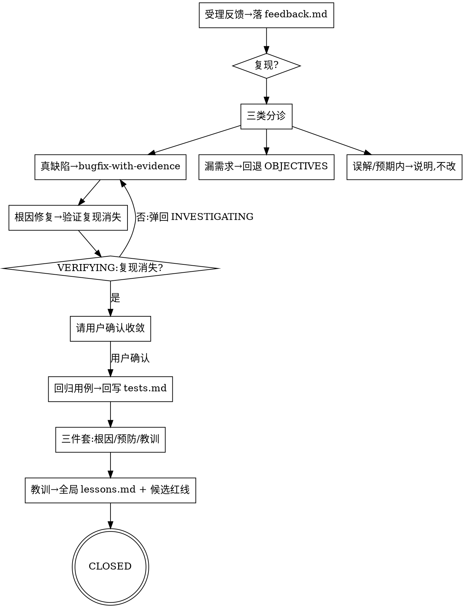
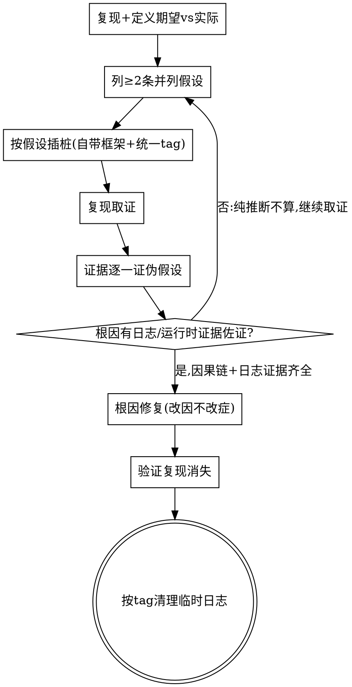

# 落地后闭环（验收反馈 + bugfix 模式）· 改动计划

**目标:** 给 Sandtable 补上落地后闭环：新增 `FEEDBACK` 阶段、两个 skill（`triaging-feedback`、`bugfix-with-evidence`）、两个命令（`/sandtable-bug`、`/sandtable-bugfix`）、per-feature `feedback.md` 产物；让每条验收 bug 驱动"根因修复 + 回归用例 + 加固推演"。

**架构:** 两个新 skill 为单一事实来源；`FEEDBACK` 阶段写入全部状态机单一事实来源并保持一致；产物落 per-feature `feedback.md`、回归用例回写该 feature `tests.md`；中英 + `plugins/sandtable` 全镜像；bugfix 日志硬门禁。外科手术式改动，不动无关 skill 的已调校文本（除授权的状态机/索引登记与交叉引用追加）。

**对应 PRD:** prd.md  
**对应 tests:** tests.md（TC1–TC14）  
**推演要求:** 本计划将由头脑预演、红蓝对抗、实现预演子 agent 逐任务推演。

## 文件地图

| 文件 | 职责 |
|------|------|
| `skills/triaging-feedback/SKILL.md` | **新建** · 验收反馈分诊（三类）+ 缺陷转 bugfix + 加固回写纪律 |
| `skills/bugfix-with-evidence/SKILL.md` | **新建** · 证据驱动根因排障闭环 + 自动收集日志纪律 + 调查分队编排 + 日志硬门禁 + 禁表面/临时修复 |
| `skills/bugfix-with-evidence/investigator-prompt.md` | **新建** · 调查分队子 agent 派发模版（类比 `red-team-wargame/opfor-prompt.md`） |
| `templates/feedback.md` | **新建** · per-feature 验收反馈台账模板（含生命周期状态/logs来源/预防/教训字段） |
| `templates/lessons.md` | **新建** · 全局教训台账模板（与 project/constraints 平级单例） |
| `scripts/sandtable-init.sh` | 全局循环加入 `lessons.md`（幂等创建，不覆盖） |
| `skills/gathering-intel/SKILL.md` | 追加交叉引用：RECON 开工前读 `lessons.md`（仅追加，不改正文） |
| `skills/red-team-wargame/SKILL.md` | 追加交叉引用：把 `lessons.md` 历史教训作为攻击向量（仅追加） |
| `skills/writing-prd/SKILL.md` | 追加交叉引用：写 PRD 前读 `lessons.md` 评估红线候选（仅追加） |
| `skills/state-and-memory/SKILL.md` | phase 枚举加 `FEEDBACK`；目录结构加 `feedback.md`；技能索引加两 skill（一行级追加，不改 Red Flags） |
| `templates/state.md` | phase 注释枚举加 `FEEDBACK` |
| `skills/using-sandtable/SKILL.md` | 状态机 dot 图 + 阶段表加 `FEEDBACK`/两命令/两 skill；与既有方法论节后补「落地后闭环」一段；技能索引追加两 skill |
| `skills/closing-the-loop/SKILL.md` | phase→下一步映射表追加 `FEEDBACK` 行 |
| `.cursor/rules/sandtable.mdc` | 状态机串 + 技能索引 + slash 列表加 `FEEDBACK`/两 skill/两命令 |
| `AGENTS.md`(=`CLAUDE.md`) | 同 rules（状态机 + 技能索引 + slash 列表） |
| `README.md` | mermaid 加 `FEEDBACK` 回环；命令入口加两命令 |
| `commands/sandtable-bug.md`、`commands/sandtable-bugfix.md` | **新建** · 中文命令源 |
| `.cursor/commands/` + `plugins/sandtable/commands/` | 两命令中文镜像 |
| `locales/en/**` | 上述全部的英文等义镜像（skills/commands/rules/AGENTS/templates） |
| `plugins/sandtable/skills/**` | 两新 skill + 受改 skill 的中文镜像 |

> 镜像基数（沿用 closed-loop-guidance 现实）：skill 4 根；command 6 根。两个新命令 → 6 文件中文?不，3 中文根 + 3 英文根 = 共 **2 命令 × 6 根 = 12** 个命令文件。两个新 skill × 4 根 = **8** 个 SKILL.md。

---

### 任务 T1: 新建 `triaging-feedback` skill（中文源）

**文件:**
- 创建: `skills/triaging-feedback/SKILL.md`

- [ ] 步骤1: 写入 frontmatter + 硬门禁 + 分诊流程：

````markdown
---
name: triaging-feedback
description: Use after a feature is delivered and the developer's own acceptance surfaces a problem (bug report / feedback). Captures the report into the feature's feedback.md, triages it into one of three classes, routes real defects through root-cause bugfix, and—after the fix—harden the loop with a regression case and an answer to "why didn't rehearsal catch this". Produces docs/sandtable/features/{id}/feedback.md.
---

# 验收反馈分诊 · 把逃逸的 bug 变成方法论的加固

**核心立场：每条逃逸到验收的 bug = 一处推演盲区。** 修它的同时必须回答"为什么三类推演没逮到它"，把答案变成回归用例 + 加固点——让 Sandtable 用 bug 反哺自己。

**开始时声明：** "我在用 triaging-feedback 做验收反馈分诊。"

<HARD-GATE>
1. 受理的反馈必须先落 `docs/sandtable/features/<id>/feedback.md`（一条一节），再处理；不得口头处理不留痕。**无 feature 兜底**：若无对应 feature 目录，先自动新建轻量 feature `<date>-bugfix-<slug>`（最小 state/feedback）。
2. **分诊为三类之一**，结论标来源（`file:line` 或 PRD 条目），不凭空判定：
   - **真缺陷**：行为与已确认需求不符 → **必须**转 `bugfix-with-evidence` 找根因，禁止跳过根因直接改（见 TC3）。
   - **漏需求**：需求当初没覆盖 → 回退 `OBJECTIVES`，按 `writing-prd`/`writing-tests` 补 PRD 与用例，不当 bug 直接改。
   - **误解 / 预期内**：行为符合需求或为理解偏差 → 说明原因与依据，不改代码（见 TC12）。
3. **生命周期**：每条反馈带显式状态 `OPEN→TRIAGED→INVESTIGATING(可反复)→ROOT_CAUSED→FIXING→VERIFYING→USER_CONFIRMED→CLOSED`；排查是反复过程，VERIFYING 未过弹回 INVESTIGATING；**未经用户确认收敛，不得置 USER_CONFIRMED/CLOSED**（不得 agent 自行宣布"已解决"而关闭）。
4. 缺陷类修复闭合后**必须**产出：(a) 回归用例追加到该 feature `tests.md`（不另起台账）；(b) **关闭三件套**：根因（因果链+证据）、**怎么预防**（流程/红线/检查项层面，非"以后小心"）、**吸取的教训**（一句可复用经验）；缺任一项不得 CLOSED。
5. **教训沉淀**：关闭时把教训追加到**全局** `docs/sandtable/lessons.md`（**不存在则按 `templates/lessons.md` 创建**——修 redteam-1 B4），并向开发者提出对 `constraints.md`(新红线)/RECON 清单(新检查项)的**候选更新**；是否采纳由开发者拍板，**不擅自**改 `constraints.md`。
</HARD-GATE>

## 分诊流程



## 与状态机的关系
- 受理反馈时把 `state.md` 的 `phase` 置为 `FEEDBACK`（战后讲评），`updated` 刷新，journal 追加 `[反馈]`。
- 缺陷修复涉及代码改动时，按需回退 `PLAN`（实现缺陷）或 `OBJECTIVES`（漏需求）走最短闭环，再回到 `VERIFY` 确认，最后回 `FEEDBACK`/`DONE`。
- **FEEDBACK 是人在环阶段**：`autopilot` 不驱动 FEEDBACK（其范围止于 EVALUATE/DONE）；FEEDBACK 仅由 `/sandtable-bug`、`/sandtable-bugfix` 手动进入；"等待用户确认收敛"是合法停点（不在自动模式擅自关闭）。恢复时 `phase=FEEDBACK` 按 phase 恢复，不参与 autopilot 配额闭包。

## Red Flags
| 念头 | 现实 |
|------|------|
| "小 bug 直接改了就行" | 缺陷类必经根因（bugfix-with-evidence），否则可能表面修复。 |
| "修好就关掉" | 不回答"为什么推演没逮到" = 浪费了这次反哺机会。 |
| "这反馈其实是漏需求，我顺手补段代码" | 漏需求回退 OBJECTIVES 补 PRD/用例，不当 bug 直接改。 |

完成后加载 `skills/closing-the-loop/SKILL.md` 输出回合收尾。
````

- [ ] 步骤2: 人工核对覆盖 TC1/TC2/TC3/TC9/TC12/TC19/TC20/TC21（分诊三类、缺陷转 bugfix、生命周期+用户确认关闭、三件套、教训沉淀、非缺陷边界）。

---

### 任务 T2: 新建 `bugfix-with-evidence` skill（中文源）

**文件:**
- 创建: `skills/bugfix-with-evidence/SKILL.md`

- [ ] 步骤1: 写入 frontmatter + 硬门禁（根因必靠日志100%）+ 自动收集 + 调查分队（动用推演武器）+ 证据驱动闭环：

````markdown
---
name: bugfix-with-evidence
description: Use whenever investigating a defect, failure, or unexpected runtime behavior (often routed from triaging-feedback / a bug report). Extends being-truthful into runtime: form multiple hypotheses, instrument key points with the project's native logging framework under a unified grep-able tag, gather evidence, falsify hypotheses until a single root cause is proven, fix at the root, verify the repro is gone, then clean up the temporary logs. Forbids surface fixes and temporary workarounds.
---

# 证据驱动排障 · 追根究底，不猜测、不表面修复

**核心立场：bugfix 是 `being-truthful` 在运行期的延伸。** 不靠"我觉得是 X"，靠**可复现的证据**锁定**单一根因**；改因不改症，不留临时绕过。

**开始时声明：** "我在用 bugfix-with-evidence 做证据驱动排障。"

<HARD-GATE>
1. **【最根本】根因必须靠日志/运行时证据 100% 确认**：**只靠读代码推断不得视为已确认根因**。锁定根因必须有**日志或运行时证据**佐证整条因果链；唯一窄例外是缺陷本质**纯静态可判定**（编译/类型错误、明显笔误）并须说明，且仍优先复现验证。"我读了代码觉得是这里"= 未确认，继续取证。**无日志出路**：日志既不能自动采、用户也给不出、又非纯静态可判定时，**不擅自降级关闭**——置 `blocked=true`、写 `questions.md` 问开发者（补日志手段或由开发者裁决）。
2. **日志框架**：插桩**优先复用工程自带日志框架**（先侦察项目用什么 logger/约定，照搬其入口与风格）；项目确无统一框架时降级到该语言**惯用**日志方式，**禁止裸 `print`/`console.log` 临时输出冒充**（除非该项目本就以此为约定，且需说明）。
3. **统一 tag**：本次排障新增的每条日志带统一可 grep 前缀 `[SANDTABLE-BUGFIX:<feature-or-bug-id>]`，便于检索与一键清理。
4. **根因后清理**：根因锁定、修复验证、复现消失后，按 tag 移除本次新增的临时日志；确有长期价值的改为项目正式日志（去 SANDTABLE-BUGFIX 临时 tag）并说明，不残留临时 tag。
5. **禁表面/临时修复**：禁止吞异常(静默 try/catch)、`sleep`/定时器规避时序、注释掉报错、仅改症状文案等；只能临时缓解时须显式标注并要求根因修复跟进。
6. **先自动收集，少打扰用户**：取证前先判断能否由 agent **自动采集**日志，能自动就**不**让用户提供；仅"只有用户能给"时才请用户提供，并给**现成命令**与落点。采集物落**仓库外/临时目录**（系统 temp 或项目外 scratch，**不入 git 仓**，因日志常含密钥/PII——修 redteam-1 B2），`feedback.md` 只记来源+关键摘录+证据出处（行号/时间戳），**绝不 `git add` 日志原文**。**Sandtable 只发 markdown，不捆绑采集 server/脚本**；临时 sink 在用户项目用其技术栈临时搭、用完即清。
</HARD-GATE>

## 自动收集日志策略（按项目识别选用，优先于让用户提供）

> 落点：采集物一律落**仓库外/临时目录**（记为 `<scratch>`，如 `$TMPDIR/sandtable-logs/<feature>/`），**不入 git 仓**；feedback.md 只记路径+摘录+行号。

| 项目类型/情形 | 自动采集做法（示例） |
|---------------|----------------------|
| Android / 连着设备 | `adb logcat -d > <scratch>/logcat.txt`（可加 `-b crash`/过滤 tag） |
| 有日志文件/目录 | 直接读 / 尾随该文件；相关时间窗摘录到 `<scratch>` |
| 能本地跑复现 | 运行复现并抓 stdout/stderr 到 `<scratch>` |
| 运行时/远程/服务 | 在**用户项目内、用用户技术栈**临时起一个 log sink 收集，纳入临时日志清理 |
| 只有用户能给（设备/生产） | 才请用户提供：指明丢到 `<scratch>`、给现成导出命令（如 `adb bugreport`、打包 `log.zip`） |

## 调查分队（非平凡缺陷：广 + 深 + 发散）

排查思维要**广**（多角度）、**深**（到根因不止症状）、**发散**（大胆列假设，不过早收敛）。

- 非平凡缺陷（多假设 / 跨子系统 / 难复现）默认派 **≥3 个并行调查子 agent**（与 redteam `min_agents` 一致），各攻一个角度：时序 / 数据流 / 依赖与配置 / 并发 / 状态与生命周期 / 外部 IO。
- **动用沙盘推演武器库**（调查分队成员按需采取不同姿态）：
  - **头脑预演（mental-rehearsal）**：只读推演候选因果链是否逻辑闭环。
  - **侦查（gathering-intel）**：系统摸清日志/数据流/依赖的"地形"，列已知与未知。
  - **红军（red-team-wargame）**：派红军**证伪候选根因**——专攻"这真的是根因吗"，攻不破（无法举出反例）才算**真根因**。
- 复用 `red-team-wargame`/`implementation-rehearsal` 的并行隔离子 agent 纪律，但**使命是找根因、非击溃计划**；每个子 agent 回报**带证据**（`file:line`/**日志**）的发现，纯推断不算（HARD-GATE 1）。
- **采集集中、子 agent 只读（修 redteam-1 B1）**：日志采集/跑复现/起 sink **由主 agent 集中先做一次**，落 `<scratch>`；调查子 agent 是**只读分析者**（对已采集日志/代码取证），**禁止各自跑复现或起 sink**，避免并行争抢设备/端口/文件、污染证据。
- 主 agent **汇总并亲自核实**，锁定**单一根因**，不轻信任一子 agent 的"我觉得"。平凡缺陷（一眼定位）允许单线，不强派。
- 子 agent 派发模版见 `./investigator-prompt.md`。

## 证据驱动闭环



## 根因闸门（出现即不通过）
- **只靠读代码推断、无日志/运行时证据 → 未确认根因，继续取证**（HARD-GATE 1，最根本）。
- 只有"我觉得/应该是"而无 `file:line`+日志证据 → 不下结论。
- 因果链有断点（不能从根因推到观察到的现象）→ 未锁定，继续。
- 修复改的是症状而非根因 → 退回，按 HARD-GATE 5 处理。

## 与 triaging-feedback / being-truthful 的关系
- 多由 `triaging-feedback`（缺陷类）或 `/sandtable-bugfix` 路由进入。
- 任何"不确定"按 `being-truthful` 处理；根因与修复结论回写 `feedback.md`、journal；修复后回 `triaging-feedback` 产出回归用例 + 加固结论。

## Red Flags
| 念头 | 现实 |
|------|------|
| "我读了代码，根因就是这儿" | 读代码不够。根因必须有日志/运行时证据 100% 佐证（HARD-GATE 1）。 |
| "大概是这儿，改了试试" | 没证据=猜。先插桩取证锁根因。 |
| "加个 try/catch 先不报错了" | 吞异常=临时修复，禁止。修根因。 |
| "print 一下看看，回头再删" | 用自带框架+统一 tag，且根因后必须清理。 |
| "症状没了就算修好" | 症状消失≠根因解决。要能讲清因果链。 |
| "一个人顺着想就行" | 思维要广+深+发散；非平凡缺陷派调查分队，红军证伪候选根因。 |
````

- [ ] 步骤2: 新建 `skills/bugfix-with-evidence/investigator-prompt.md`（调查分队派发模版）：

```markdown
# 调查子 agent 派发模版 · investigator-prompt

你是一名调查兵，使命是**为指定角度找根因证据**，不是击溃计划，也不是给结论。

- 目标缺陷：<期望 vs 实际 + 复现步骤>
- 你的角度：<时序 / 数据流 / 依赖与配置 / 并发 / 状态与生命周期 / 外部 IO 之一>
- 你的姿态（按需）：头脑预演（推因果链）/ 侦查（摸地形）/ 红军（证伪候选根因，攻不破才算真根因）
- 已采集日志（主 agent 集中采好）：<scratch 路径>
- 纪律：**只读分析**——只读已采集日志/代码，**禁止自行跑复现、起 sink、改代码**（采集是主 agent 的事，避免并行撞车）；只报**带日志/运行时证据**的发现（`file:line` + 日志行）；**纯读代码推断不算根因**；不确定按 being-truthful，不猜；思维要广+深+发散。
- 返回：本角度下最可能的因果链片段 + 支撑**日志证据**出处；若证伪某假设，说明依据。
```

- [ ] 步骤3: 人工核对覆盖 TC4/TC5/TC6/TC7/TC8/TC13/TC15/TC17/TC18/TC23/TC24（不猜测、根因必靠日志100%、三门禁、禁表面修复、无框架降级、先自动收集、调查分队≥3+推演武器、纯 markdown 不捆绑工具）。

---

### 任务 T3: 新建 `templates/feedback.md`

**文件:**
- 创建: `templates/feedback.md`

- [ ] 步骤1: 写入模板：

```markdown
# 验收反馈台账 · Feedback（落地后，只增不改历史结论）

> 每条验收反馈/bug 一节。由 triaging-feedback 受理、bugfix-with-evidence 找根因。
> 回归用例回写本 feature 的 tests.md，不在此另起台账。

## BUG<N>
- 生命周期：OPEN / TRIAGED / INVESTIGATING / ROOT_CAUSED / FIXING / VERIFYING / USER_CONFIRMED / CLOSED
  （排查可反复：VERIFYING 未过弹回 INVESTIGATING；未经用户确认收敛不得 USER_CONFIRMED/CLOSED）
- 来源：（验收 / 线上 / 其他；何时、谁）
- 复现步骤：
- 期望：
- 实际：
- 严重度：（阻断 / 严重 / 一般 / 轻微）
- 日志来源：（自动采集命令 / 用户提供；落点=**仓库外** scratch 路径；只记关键摘录+行号，**原文不入库**，含密钥风险）
- 分诊结论：（真缺陷 / 漏需求 / 误解或预期内；依据 file:line 或 PRD 条目）
- 根因：（带因果链 + 证据出处 file:line / 日志行；缺陷类修复前不得为空）
- 修复指向：（改了哪个文件/任务）
- 回归用例：（指向 tests.md 的 TC 编号）
- 用户确认：（用户何时确认收敛/解决；未确认不得关闭）
- 怎么预防：（流程/红线/检查项层面措施，非"以后小心"）
- 吸取的教训：（一句可复用经验 → 已写入 lessons.md；候选红线/检查项更新建议）
```

- [ ] 步骤2: 验证引用 TC1/TC9：字段含 期望/实际/分诊/根因/回归用例/加固结论。

---

### 任务 T4: 新增 `FEEDBACK` 阶段到状态机全部单一事实来源

**文件:**
- 修改: `skills/state-and-memory/SKILL.md`
- 修改: `templates/state.md`
- 修改: `skills/using-sandtable/SKILL.md`
- 修改: `skills/closing-the-loop/SKILL.md`
- 修改: `.cursor/rules/sandtable.mdc`
- 修改: `AGENTS.md`
- 修改: `README.md`

- [ ] 步骤1: `skills/state-and-memory/SKILL.md`
  - phase 枚举行（约 :39）末尾追加 `|FEEDBACK`：`...|VERIFY|DONE|FEEDBACK`。
  - 目录结构（约 :24 `rehearsals/` 同级）追加一行：`feedback.md                   # 验收反馈台账 (见 triaging-feedback)`。（**修 redteam-1 B2**：日志**不**放仓库内；采集日志落仓库外/临时目录，feedback.md 只记路径+摘录，故目录结构**不列 logs/**。）
  - 文末「相关技能」或恢复流程前追加两行索引：`- triaging-feedback — 验收反馈分诊与加固`、`- bugfix-with-evidence — 证据驱动根因排障`。
  - 追加一小段：`FEEDBACK 阶段：DONE 后用户验收反馈进入；缺陷类回环 bugfix→修复→回归→加固，必要时回退 OBJECTIVES/PLAN，再回 VERIFY/DONE。`
  - **（修 mental-1 M2）恢复流程/配额闭包分支补 FEEDBACK 情形**：在 `state-and-memory` 的"恢复流程"自动模式分支（约 :117-124）追加一句：`phase 处于 DONE 或 FEEDBACK（落地后）时，autopilot 配额闭包不适用，一律按 phase 恢复；FEEDBACK 是人在环阶段，autopilot 不驱动，不得因三类配额已达标而被误路由回 EVALUATE。` 仅追加该分支说明，不改 Red Flags/其他正文。
  - **不改** Red Flags 表正文。

- [ ] 步骤2: `templates/state.md` phase 注释行追加 `|FEEDBACK`（与枚举一致）。

- [ ] 步骤3: `skills/using-sandtable/SKILL.md`
  - dot 状态机：在 `VERIFY -> DONE;` 后追加 `DONE -> FEEDBACK [label="用户验收反馈"]; FEEDBACK -> FIX [label="缺陷→根因/重演"];`（FIX 已存在，指回 OBJ）。
  - 阶段表追加一行：`| FEEDBACK | 战后讲评 | 受理验收反馈,分诊,缺陷转bugfix根因,回归+加固 | triaging-feedback / bugfix-with-evidence | /sandtable-bug /sandtable-bugfix |`。
  - 「与既有方法论的关系」节后追加一段「落地后闭环」：说明 bug=推演盲区、修复须回归+加固。
  - 技能索引（若该文件含）追加两 skill 行。

- [ ] 步骤4: `skills/closing-the-loop/SKILL.md` phase→下一步映射表追加：
  `| FEEDBACK | 分诊/根因/加固 | /sandtable-bug（受理）· /sandtable-bugfix（根因）· 修复后回 /sandtable-status |`
  （置于 `VERIFY / DONE` 行之后；保持其余行不动。）

- [ ] 步骤5: `.cursor/rules/sandtable.mdc`
  - 核心闭环串（含 `... VERIFY → DONE`）追加 `→ FEEDBACK（落地后闭环，可重入）`。
  - 技能索引追加两 skill 行。
  - Slash 命令列表追加 `/sandtable-bug` `/sandtable-bugfix`。

- [ ] 步骤6: `AGENTS.md` 同 rules：状态机串、技能索引、slash 列表三处追加（`CLAUDE.md` 为软链，自动同步）。

- [ ] 步骤7: `README.md`
  - mermaid：`K[VERIFY] --> L[DONE]` 后追加 `L --> N[FEEDBACK]` 与 `N -- 缺陷→根因/重演 --> M[主 agent 核实]`。
  - 「命令入口」节追加：`/sandtable-bug`、`/sandtable-bugfix` 各一行。

- [ ] 步骤8: 验证引用 TC10：
  - `rg -n "FEEDBACK" skills/state-and-memory/SKILL.md skills/using-sandtable/SKILL.md skills/closing-the-loop/SKILL.md .cursor/rules/sandtable.mdc AGENTS.md templates/state.md README.md` 每文件至少 1 命中。

---

### 任务 T5: 新建 `/sandtable-bug` 与 `/sandtable-bugfix` 命令（中文 3 根）

**文件:**
- 创建: `commands/sandtable-bug.md`、`commands/sandtable-bugfix.md`
- 创建: `.cursor/commands/sandtable-bug.md`、`.cursor/commands/sandtable-bugfix.md`
- 创建: `plugins/sandtable/commands/sandtable-bug.md`、`plugins/sandtable/commands/sandtable-bugfix.md`

- [ ] 步骤1: `commands/sandtable-bug.md`：

```markdown
---
description: 受理一条验收反馈/bug，落 feedback.md 并分诊，必要时进入 FEEDBACK 阶段。
---

受理我接下来描述的验收反馈；读取并遵循 `skills/triaging-feedback/SKILL.md`。

执行：
1. 确认当前 feature（读 `docs/sandtable/`）。**若反馈针对的代码没有对应 feature 目录**，自动新建轻量 feature `<date>-bugfix-<slug>`（最小 state.md/feedback.md）再继续。把反馈作为一条 BUG 节追加到该 feature 的 `feedback.md`（用 `templates/feedback.md`），填复现/期望/实际/严重度。
2. 分诊为三类之一（真缺陷 / 漏需求 / 误解或预期内），结论标来源。
3. 真缺陷 → 提示用 `/sandtable-bugfix` 进入根因闭环；漏需求 → 回退 OBJECTIVES；误解 → 说明不改。
4. 更新 `state.md`（phase=FEEDBACK）、journal 追加 `[反馈]`。
5. 完成后加载 `skills/closing-the-loop/SKILL.md` 输出收尾。

我反馈的问题是：
```

- [ ] 步骤2: `commands/sandtable-bugfix.md`：

```markdown
---
description: 对一个缺陷启动证据驱动根因排障闭环：插桩取证、锁根因、根因修复、清理。
---

对我接下来描述的缺陷启动 bugfix 闭环；读取并遵循 `skills/bugfix-with-evidence/SKILL.md`。

执行：
1. 复现并定义期望 vs 实际；列 ≥2 条并列假设。
2. 用工程自带日志框架、统一 tag `[SANDTABLE-BUGFIX:<feature-or-bug-id>]` 在关键点插桩；复现取证。
3. 证据逐一证伪假设直到锁定单一根因（因果链 + 证据出处齐全）。
4. 根因修复（改因不改症，禁表面/临时修复）；验证复现消失。
5. 按 tag 清理临时日志；把根因/修复回写 `feedback.md` 与 journal。
6. 回 `triaging-feedback` 产出回归用例（回写 tests.md）+ 加固结论。
7. 完成后加载 `skills/closing-the-loop/SKILL.md` 输出收尾。

我要排查的缺陷是：
```

- [ ] 步骤3: `cp commands/sandtable-bug.md .cursor/commands/sandtable-bug.md`；`cp commands/sandtable-bugfix.md .cursor/commands/sandtable-bugfix.md`；同样复制到 `plugins/sandtable/commands/`（中文三根一致）。

- [ ] 步骤4: 验证引用 TC11（中文部分）：`for r in commands .cursor/commands plugins/sandtable/commands; do test -f $r/sandtable-bug.md && test -f $r/sandtable-bugfix.md; done`。

---

### 任务 T6: 同步镜像与英文 locale

**文件:**
- 创建: `plugins/sandtable/skills/triaging-feedback/SKILL.md`、`plugins/sandtable/skills/bugfix-with-evidence/SKILL.md`
- 创建: `locales/en/skills/{triaging-feedback,bugfix-with-evidence}/SKILL.md`
- 创建: `locales/en/plugins/sandtable/skills/{triaging-feedback,bugfix-with-evidence}/SKILL.md`
- 创建: `locales/en/commands/{sandtable-bug,sandtable-bugfix}.md`、`locales/en/.cursor/commands/{...}`、`locales/en/plugins/sandtable/commands/{...}`
- 创建: `locales/en/templates/feedback.md`（若 en 有 templates 镜像；先确认 `locales/en/templates` 是否存在，无则不创建，遵循现状）
- 修改: `plugins/sandtable/skills/{state-and-memory,using-sandtable,closing-the-loop}/SKILL.md`、`locales/en/...` 对应 T4 改动；`locales/en/AGENTS.md`、`locales/en/.cursor/rules/sandtable.mdc`

- [ ] 步骤1: 中文 plugins skill 镜像：`cp skills/triaging-feedback/SKILL.md plugins/sandtable/skills/triaging-feedback/SKILL.md`；bugfix 同理（含 `investigator-prompt.md` 一并复制）。
- [ ] 步骤2: 撰写英文等义 skill（4 个文件 = en/skills 2 + en/plugins 2）+ 英文 `investigator-prompt.md`（en/skills、en/plugins 各一，中文源已含 zh 两根）；正文英文，slash 仍 `/sandtable-*`，tag 仍 `[SANDTABLE-BUGFIX:<id>]`。
- [ ] 步骤3: 英文命令 6 文件（en 的 3 个 command 根 × 2 命令），description/正文英文。
- [ ] 步骤4: 把 T4 的 `FEEDBACK`/索引改动同步到中文 `plugins/sandtable/skills/{state-and-memory,using-sandtable,closing-the-loop}` 与英文 `locales/en/skills/...`、`locales/en/plugins/sandtable/skills/...`、`locales/en/AGENTS.md`、`locales/en/.cursor/rules/sandtable.mdc`、`locales/en/README.md`（若存在）。
- [ ] 步骤5: 先确认 en 模板镜像现状：`ls locales/en/templates 2>/dev/null`；存在才镜像 `feedback.md`，否则按现状不新增（不节外生枝）。
- [ ] 步骤6: 验证引用 TC11：
  - skill 4 根各有两 skill + bugfix skill 含 investigator-prompt：`for r in skills plugins/sandtable/skills locales/en/skills locales/en/plugins/sandtable/skills; do test -d $r/triaging-feedback && test -f $r/bugfix-with-evidence/SKILL.md && test -f $r/bugfix-with-evidence/investigator-prompt.md; done`
  - 命令 6 根各有两命令（含 en 3 根）。
  - `rg -n "FEEDBACK" locales/en/skills/using-sandtable/SKILL.md locales/en/AGENTS.md` 命中。

---

### 任务 T8: 全局教训闭环（lessons.md + init + 反哺交叉引用）

**文件:**
- 创建: `templates/lessons.md`
- 修改: `scripts/sandtable-init.sh`
- 修改: `skills/state-and-memory/SKILL.md`（全局文件区 + 目录结构加 `lessons.md`）
- 修改: `skills/gathering-intel/SKILL.md`、`skills/red-team-wargame/SKILL.md`、`skills/writing-prd/SKILL.md`（各追加一句交叉引用，不改已调校正文）

- [ ] 步骤1: 新建 `templates/lessons.md`：

```markdown
# 全局教训台账 · Lessons（跨 feature 累积，只增不改历史条目）

> 每条来自一次已关闭的验收反馈/缺陷。开新需求时 RECON / 红蓝对抗 / 写 PRD 必读本文件，把过去的坑变成未来的检查项与攻击向量。

## <YYYY-MM-DD> · 来源 <feature>/<BUG<N>>
- 根因摘要：
- 怎么预防：（流程/红线/检查项层面）
- 吸取的教训：（一句可复用经验）
- 候选红线/检查项更新：（建议加到 constraints.md 的 MUST/MUST-NOT，或 RECON 清单；是否采纳由开发者拍板）
- 采纳情况：（待定 / 已采纳到 constraints.md / 已并入 RECON 清单 / 不采纳+理由）
```

- [ ] 步骤2: `scripts/sandtable-init.sh` 全局循环（约 :68 `for f in project.md constraints.md; do`）改为 `for f in project.md constraints.md lessons.md; do`（幂等：已存在则跳过，沿用现有逻辑）。
- [ ] 步骤3: `skills/state-and-memory/SKILL.md`
  - 目录结构顶部全局区（`project.md`/`constraints.md` 同级）追加：`lessons.md                       # 全局教训台账, 跨 feature 累积 (见 triaging-feedback FR-LESSONS)`。
- [ ] 步骤4: 三处交叉引用（仅追加，不改 Red Flags/硬门禁正文；**修 redteam-1 B4：均措辞为"若存在 lessons.md 则读"，不存在则跳过不报错**）：
  - `gathering-intel`：侦察清单或流程末追加「开工前**若存在** `docs/sandtable/lessons.md` 则读，把相关历史教训列为本次检查项」。
  - `red-team-wargame`：进攻向量表后追加一行「**教训复盘**：**若有** `lessons.md`，拿命中过的历史教训作为本轮攻击向量复打」。
  - `writing-prd`：流程「读 project.md + constraints.md」处补「+ `lessons.md`（若存在）」，评估是否需要对应红线候选。
- [ ] 步骤5: 验证引用 TC21/TC22：
  - `rg -n "lessons.md" skills/state-and-memory/SKILL.md skills/gathering-intel/SKILL.md skills/red-team-wargame/SKILL.md skills/writing-prd/SKILL.md scripts/sandtable-init.sh` 各命中。
  - `test -f templates/lessons.md`。
- [ ] 步骤6: 镜像同步：`templates/lessons.md`、改动后的 init 脚本（如有 `locales/en/scripts` 镜像）、四个 skill 的交叉引用，同步到 `plugins/sandtable/`、`locales/en/`（含 en plugins）对应路径；英文等义。

---

### 任务 T7: 全局一致性核对（接 VERIFY）

- [ ] 步骤1: `rg -n "triaging-feedback|bugfix-with-evidence" skills plugins/sandtable/skills locales/en .cursor/rules AGENTS.md README.md` 覆盖全部接入点。
- [ ] 步骤2: `rg -n "sandtable-bug|sandtable-bugfix" commands .cursor/commands plugins/sandtable/commands locales/en README.md .cursor/rules/sandtable.mdc AGENTS.md` 覆盖命令登记。
- [ ] 步骤3: 逐条对照 tests.md TC1–TC28 人工核对（实现后）。
- [ ] 步骤4: 确认未改无关 skill 的 Red Flags/硬门禁正文（gathering-intel/red-team-wargame/writing-prd 仅**追加**交叉引用）；未新增 node/python 依赖；未擅自改 `constraints.md` 红线；未破坏用户 `docs/sandtable/`。
- [ ] 步骤5: `rg -n "lessons.md" skills scripts templates plugins/sandtable locales/en` 覆盖教训闭环全部接入点。

## 全局验证（VERIFY 阶段）

- [ ] TC1–TC28 全绿（人工 + 上述 rg/test 命令）。
- [ ] `FEEDBACK` 在 7 个状态机单一事实来源一致；恢复分支含 FEEDBACK/DONE 按 phase 恢复（修 M2）。
- [ ] 两 skill 4 根、两命令 6 根、`investigator-prompt.md` 4 根、`templates/{feedback,lessons}.md` + 镜像齐备；英文等义。
- [ ] bugfix skill 含「自动收集策略表」「调查分队（≥3 并行，集中采集+只读分析）」「根因必靠日志100%」硬门禁；feedback 模板含生命周期/日志来源(仓库外)/预防/教训字段；state-and-memory 目录结构含全局 `lessons.md`、**不含 logs/**（日志在仓库外）。
- [ ] 反馈生命周期含用户确认关闭闸门 + FEEDBACK 人在环（autopilot 不驱动）；关闭三件套强制；无日志→blocked；`lessons.md` 跨 feature 累积、按需创建、"若存在则读"；三处 skill 读 `lessons.md`；`sandtable-init.sh` 全局循环含 `lessons.md`。
- [ ] **安全（修 B2）**：采集日志一律落仓库外，agent 绝不 `git add` 日志原文、不放进 `docs/sandtable/`、不自动改用户 `.gitignore`。
- [ ] 符合 constraints.md：**交付物仅 markdown（+ init 脚本仅加一词）**、零运行时依赖、未捆绑日志 server/采集脚本/插桩工具、未擅改 constraints 红线、幂等、不毁数据、外科手术式（TC18）。
