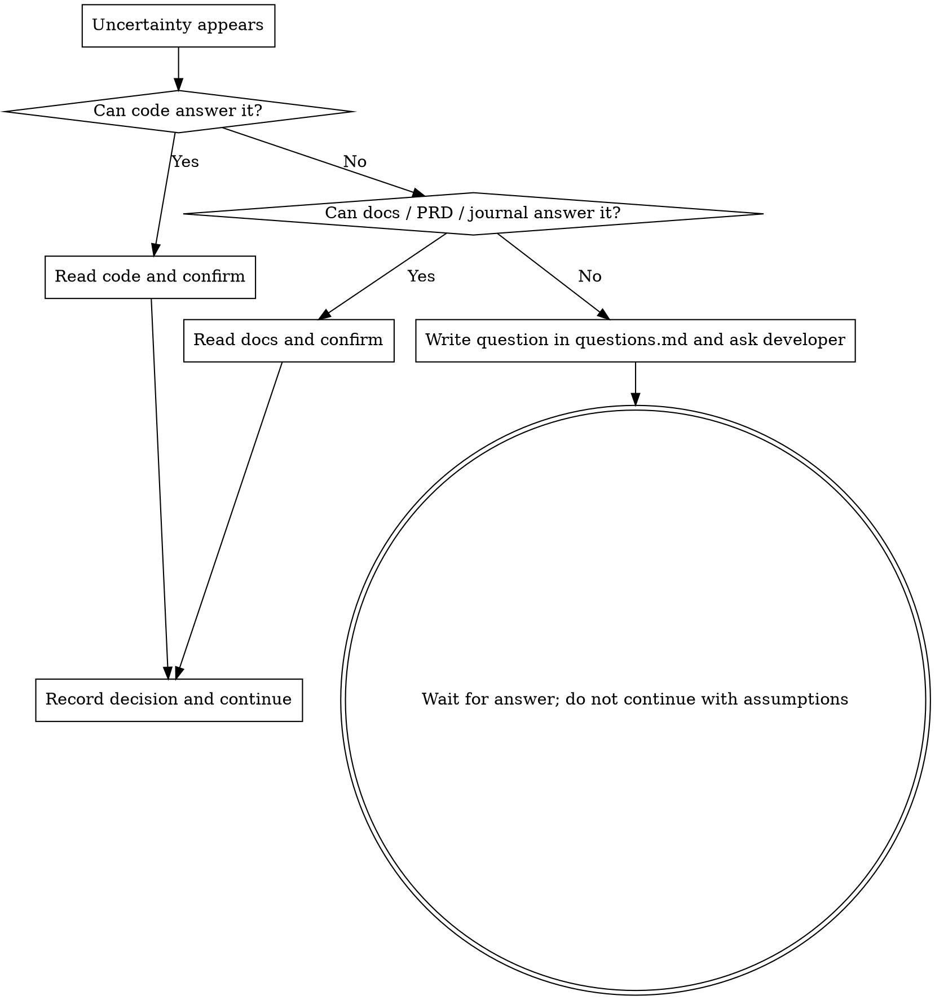

# Truthfulness · No Guessing, No Fabrication

**Core principle: if something is unclear, never fill the gap with imagination.** Any thought like "probably," "I guess," or "usually" is a danger sign.

## HARD GATE

<HARD-GATE>
While writing a plan, running rehearsals, or changing code, if you are not 100% sure about any fact, behavior, interface signature, requirement intent, or boundary condition, you must resolve it before continuing. You may not proceed with unverified assumptions.
</HARD-GATE>

## Three Ways to Resolve Uncertainty (in order)

1. **Read code**: if code / tests / type definitions can confirm it, confirm it directly and cite `file:line`.
2. **Read docs**: project docs, `docs/sandtable/` files like `project.md` / `prd.md` / `journal.md`, README, commit history.
3. **Ask the developer**: if the first two cannot determine it, write the question into `questions.md` and ask directly. Ask the important questions in one batch.

**After you get the answer**: write it back into the relevant place in `prd.md` / `tests.md` / `plan.md`, and append a decision record to `journal.md` (who, when, what was decided, and why).

## Distinguish Fact from Assumption

Whenever you state a fact that supports a decision, mark the source:
- `[confirmed: src/foo.ts:42]` - from reading code
- `[confirmed: prd.md#acceptance]` - from reading docs
- `[awaiting developer confirmation]` - not yet confirmed, already written into `questions.md`
- Never present an important judgment without a source label.

## Rationalization Table (Stop When You Hear These)

| Excuse | Reality |
|------|------|
| "It probably works like this." | "Probably" means not confirmed. Read the code. |
| "Frameworks usually do it this way." | This project may not. Confirm it. |
| "I’ll write it based on my understanding and fix it later." | A wrong rehearsal or implementation wastes the entire loop. Confirm first. |
| "Asking the developer is awkward / makes me look uninformed." | Shipping on a false assumption looks worse. Ask. |
| "That edge case probably won’t happen." | Probably = not verified. Either confirm it cannot happen or handle it intentionally. |
| "The PRD didn’t specify it, so I’ll choose a sensible default." | Missing requirements must be asked, not invented. |

## Relationship to Rehearsals

When a rehearsal exposes uncertainty, that is one of the most valuable findings; it is exactly the kind of discovery that should be stopped and reported as an `ANOMALY`. If you guess and keep going, the rehearsal loses its purpose.
