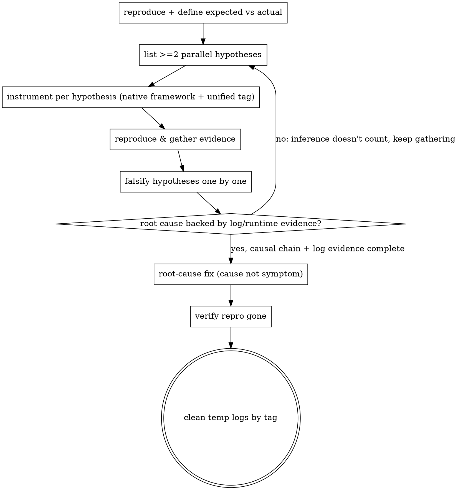

# bugfix mode · Evidence-driven root-cause, no guessing, no surface fix

**Core stance: bugfix is `being-truthful` extended into runtime.** Not "I think it's X" — lock the **single root cause** with **reproducible log/runtime evidence**; fix the cause not the symptom, leave no temporary workaround.

**Announce at start:** "I'm using bugfix-with-evidence for evidence-driven debugging."

<HARD-GATE>
1. **[MOST FUNDAMENTAL] The root cause MUST be confirmed by log/runtime evidence at 100%**: **reading code alone does NOT count as a confirmed root cause**; locking the root cause requires log or runtime evidence threading the whole causal chain. The only narrow exception: the defect is **purely statically determinable** (compile/type error, obvious typo) and must be stated, still preferring a reproduction. **No-log escape**: if logs can neither be auto-collected nor provided by the user, and it isn't statically determinable → **do not downgrade unilaterally**; set `blocked=true`, write `questions.md` and ask the developer (add a logging means, or let the developer decide).
2. **Logging framework**: instrument by **reusing the project's native logging framework first** (recon what logger/convention the project uses, mirror its entry/style); if there truly is no unified framework, fall back to the language's **idiomatic** logging, **never substitute bare `print`/`console.log`** (unless the project's own convention, with explanation).
3. **Unified tag**: every log added for this investigation carries the unified grep-able prefix `[SANDTABLE-BUGFIX:<feature-or-bug-id>]` for retrieval and one-shot cleanup.
4. **Clean up after root cause**: once the root cause is locked, fix verified, repro gone, remove this investigation's temporary logs by tag; anything of lasting value becomes a project formal log (drop the SANDTABLE-BUGFIX temp tag) with explanation — no leftover temp tags.
5. **No surface/temporary fix**: forbidden — swallowing exceptions (silent try/catch), `sleep`/timer to dodge timing, commenting out errors, only changing symptom text; temporary mitigation must be flagged explicitly and still require a root-cause follow-up.
6. **Auto-collect first, minimize bothering the user**: before gathering evidence, judge whether the agent can **auto-collect** logs; if so, do **not** ask the user; only when "only the user can provide" do you ask, with a ready-made command. Collected artifacts land in a **directory outside the repo / temp dir** (system temp or out-of-project scratch, **not in the git repo**, since logs often contain secrets/PII); `feedback.md` records only source + key excerpts + evidence location (line/timestamp), and you **never `git add` raw logs**, never put them in `docs/sandtable/`, never auto-edit the user's `.gitignore`. **Sandtable ships only markdown, bundles no collection server/script**; a temporary sink is built ad-hoc in the user's project with their stack and torn down after use.
</HARD-GATE>

## Auto-collection strategies (pick by project type, prefer over asking the user)

> Drop location: collected artifacts always land in a **directory outside the repo / temp dir** (denoted `<scratch>`, e.g. `$TMPDIR/sandtable-logs/<feature>/`), **not in the git repo**; feedback.md records only path + excerpts + line numbers.

| Project type / situation | Auto-collection (example) |
|--------------------------|---------------------------|
| Android / device attached | `adb logcat -d > <scratch>/logcat.txt` (optionally `-b crash`/tag filter) |
| Has log files/dirs | read / tail the file directly; excerpt the relevant time window into `<scratch>` |
| Can reproduce locally | run the repro and capture stdout/stderr to `<scratch>` |
| Runtime/remote/service | spin up a temporary log sink **inside the user's project, with their stack**, included in temp-log cleanup |
| Only the user can provide (device/prod) | only then ask: point to `<scratch>`, give a ready-made export command (`adb bugreport`, zip `log.zip`) |

## Investigation squad (non-trivial defects: broad + deep + divergent)

Investigation thinking must be **broad** (many angles), **deep** (to the root, not the symptom), **divergent** (boldly list hypotheses, don't converge early).

- Non-trivial defects (many hypotheses / cross-subsystem / hard to reproduce) by default dispatch **≥3 parallel investigation subagents** (matching `red-team-wargame` `min_agents`), each on one angle: timing / data flow / dependencies & config / concurrency / state & lifecycle / external IO.
- **Use the sandtable rehearsal arsenal** (members adopt stances as needed):
  - **mental-rehearsal**: read-only reasoning whether a candidate causal chain closes logically.
  - **gathering-intel**: systematically map the "terrain" of logs/data-flow/dependencies; list knowns and unknowns.
  - **red-team-wargame**: dispatch red team to **falsify the candidate root cause** — attack "is this really the root cause"; only what can't be broken (no counterexample) counts as the **true root cause**.
- **Centralized collection, read-only subagents**: log collection / running the repro / spinning a sink is done **once, centrally, by the main agent** into `<scratch>`; investigation subagents are **read-only analysts** (over already-collected logs/code) and **must not each run the repro or spin a sink**, to avoid parallel contention over device/ports/files and evidence pollution.
- Each subagent reports findings **with log evidence** (`file:line` + log lines); pure inference doesn't count (HARD-GATE 1). The main agent **synthesizes and personally verifies**, locking a **single root cause**, never trusting any one subagent's "I think". Trivial defects (located at a glance) may be single-track, no forced squad.
- Subagent dispatch template: `./investigator-prompt.md`.

## Evidence-driven loop

## Root-cause gate (any => not passed)
- **Code-reading inference only, no log/runtime evidence → root cause NOT confirmed, keep gathering** (HARD-GATE 1, most fundamental).
- Only "I think/should be" without `file:line`+log evidence → no conclusion.
- Causal chain has a gap (can't derive observed symptom from the cause) → not locked, continue.
- Fix changes the symptom not the cause → revert, handle per HARD-GATE 5.

## Relation to triaging-feedback / being-truthful
- Usually entered from `triaging-feedback` (defect class) or `/sandtable-bugfix`.
- Any "uncertainty" goes through `being-truthful`; root cause and fix conclusions are written back to `feedback.md`, journal; after the fix, return to `triaging-feedback` to produce the regression case + trio (root cause/prevention/lesson).

## Red Flags
| Thought | Reality |
|---------|---------|
| "I read the code, the root cause is here" | Reading code isn't enough. Root cause must be backed by log/runtime evidence at 100% (HARD-GATE 1). |
| "Probably here, just try a change" | No evidence = guessing. Instrument and gather first. |
| "Add a try/catch to silence it" | Swallowing exceptions = temporary fix, forbidden. Fix the cause. |
| "Just print and remove later" | Use native framework + unified tag, and clean up after root cause. |
| "Symptom gone = fixed" | Symptom gone ≠ cause resolved. You must explain the causal chain. |
| "One person reasoning is enough" | Think broad+deep+divergent; non-trivial defects dispatch a squad, red team falsifies the candidate root cause. |
| "Can't get logs, just change per my inference" | Can't get logs → escalate to blocked and ask the developer; don't downgrade unilaterally. |
