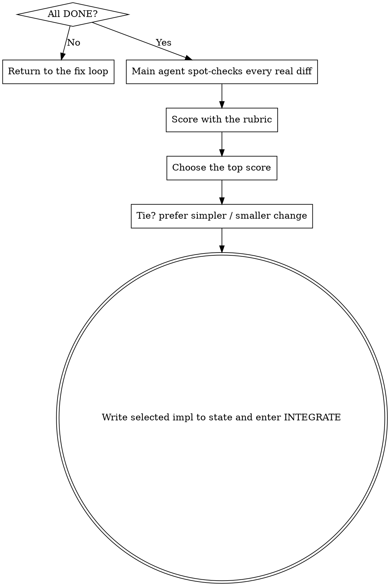

# Scoring and Choosing Among Rehearsals

**Core rule: only when multiple implementation rehearsals all pass cleanly do you score them and choose the strongest one.** If any rehearsal is still `ANOMALY` / `BLOCKED`, do not score yet.

**State this when you begin:** "I am using evaluating-rehearsals to score the rehearsal results."

## HARD GATE

<HARD-GATE>
Only score the round if every implementation rehearsal returned `DONE`. Any `ANOMALY_FOUND` / `BLOCKED` sends you back to: main agent verifies personally -> ask developer if needed -> fix PRD / plan -> rehearse again.
</HARD-GATE>

## Flow

The main agent must personally read the real diff from every rehearsal, not just the subagent’s self-assessment.

## Rubric

| Dimension | Meaning | Suggested weight |
|------|------|------|
| Requirement fit | Fully satisfies all PRD requirements and acceptance criteria | x3 |
| Red-line compliance | Zero violations of MUST / MUST-NOT | veto |
| Evidence of correctness | Tests genuinely validate behavior and key paths | x3 |
| Minimalism | Smallest change set that still achieves the goal | x2 |
| Surgical scope | Touches only what should be touched | x2 |
| Readability / maintainability | Clear naming, focused structure | x1 |
| Fit with existing patterns | Matches project conventions | x1 |

`Red-line compliance` is a veto: any implementation that violates a MUST / MUST-NOT is eliminated regardless of score.

## Selection Rules

1. Highest total score wins.
2. If scores are close (<10% apart), choose the simpler option with the smaller change set.
3. Write the selected report path into `state.md:selected_impl`, set `phase=INTEGRATE`, and record the scoring rationale in `journal.md`.
4. Clean up unselected worktrees / branches.

## Output

Give the developer a brief comparison: total score per rehearsal, key differences, and why the winning option was chosen. The developer may still override the choice.

## Red Flags

| Thought | Reality |
|------|------|
| "One implementation is DONE, another is BLOCKED, so I can just use the DONE one." | First verify whether the BLOCKED run exposed a plan flaw that affects all options. |
| "The self-scores are enough; I don’t need the diffs." | You must inspect the real diffs. |
| "The most feature-rich option is the best." | Over-implementation and scope creep should be penalized. Minimalism matters. |
| "If they tie, I’ll just pick one." | Prefer the simpler and smaller change. |

## Feature Addendum: Implementation Completeness Gate

`DONE` is only the candidate's self-report. Do not enter `evaluating-rehearsals`, debrief, or EVALUATE until the completeness gate passes. After all candidates report `DONE`, the main agent must run the gate itself for simple candidates or may dispatch read-only mental/redteam-style reviewers for complex or high-risk candidates.

The gate must include:
- The main agent independently reads the current `prd.md`, `tests.md`, and `plan.md` and recomputes the structured verification baseline. Candidate-embedded baselines, coverage matrices, or TODO tables are inputs, not facts.
- Stable keys: `FRx` from PRD numbering; `PRD-AC1...n` from top-level bullets in the PRD acceptance criteria section; `MUST-1...n` and `MNOT-1...n` from top-level MUST / MUST NOT bullets; `TCx` from tests; `PLAN Tx/step x` from every checkbox in `plan.md`, preserving decimal step numbers.
- Body hash: normalize each item as UTF-8 text, LF newlines, trim trailing whitespace, preserve internal order and indentation semantics, then compute SHA-256. Any added, removed, renamed, changed, or missing-hash FR/PRD-AC/MUST/MNOT/TC/PLAN checkbox changes the baseline.
- The gate conclusion records review time, candidate worktree/branch, the current three-document structured baseline, and a real diff or changed-file-list summary. Do not use impl report mtime, coarse prose summaries, or id sets alone for staleness.
- Check the coverage matrix and live execution TODO table against the real diff / changed file list. Empty diff, missing planned file families, no main-agent diff check, omitted keys, aggregate keys, unsupported `not-applicable`, `missing`, or `blocked` all fail the gate.

Each candidate `DONE` report must include:
- Coverage matrix: PRD `FRx`, PRD acceptance `PRD-ACx`, PRD redlines `MUST-x/MNOT-x`, TESTS `TCx`, and PLAN `Tx/step x`, each with status and evidence. Do not replace checkbox-level PLAN coverage with task-level summaries.
- Live execution TODO table with `item` / `source` / `status` / `evidence`; items use `PRD FRx`, `PRD-ACx`, `MUST-x`, `MNOT-x`, `TCx`, or `PLAN Tx/step x`; status is only `done`, `not-applicable`, `blocked`, or `missing`. This table lives inside the candidate report only; it does not create a separate TODO file or replace `plan.md` / `state.md`.
- The matrix and TODO table must have matching PRD FR, PRD-AC, MUST/MNOT, TC, and PLAN step key sets. Conflicts use the finer-grained `missing` / `blocked` result.
