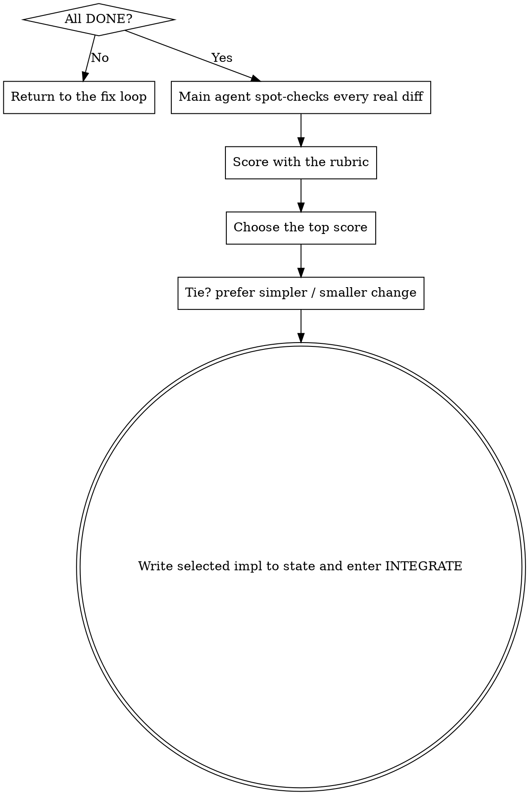

# Scoring and Choosing Among Rehearsals

**Core rule: only when multiple implementation rehearsals all pass cleanly do you score them and choose the strongest one.** If any rehearsal is still `ANOMALY` / `BLOCKED`, do not score yet.

**State this when you begin:** "I am using evaluating-rehearsals to score the rehearsal results."

## HARD GATE

<HARD-GATE>
Only score the round if every implementation rehearsal returned `DONE`. Any `ANOMALY_FOUND` / `BLOCKED` sends you back to: main agent verifies personally -> ask developer if needed -> fix PRD / plan -> rehearse again.
</HARD-GATE>

## Flow

The main agent must personally read the real diff from every rehearsal, not just the subagent’s self-assessment.

## Rubric

| Dimension | Meaning | Suggested weight |
|------|------|------|
| Requirement fit | Fully satisfies all PRD requirements and acceptance criteria | x3 |
| Red-line compliance | Zero violations of MUST / MUST-NOT | veto |
| Evidence of correctness | Tests genuinely validate behavior and key paths | x3 |
| Minimalism | Smallest change set that still achieves the goal | x2 |
| Surgical scope | Touches only what should be touched | x2 |
| Readability / maintainability | Clear naming, focused structure | x1 |
| Fit with existing patterns | Matches project conventions | x1 |

`Red-line compliance` is a veto: any implementation that violates a MUST / MUST-NOT is eliminated regardless of score.

## Selection Rules

1. Highest total score wins.
2. If scores are close (<10% apart), choose the simpler option with the smaller change set.
3. Write the selected report path into `state.md:selected_impl`, set `phase=INTEGRATE`, and record the scoring rationale in `journal.md`.
4. Clean up unselected worktrees / branches.

## Output

Give the developer a brief comparison: total score per rehearsal, key differences, and why the winning option was chosen. The developer may still override the choice.

## Red Flags

| Thought | Reality |
|------|------|
| "One implementation is DONE, another is BLOCKED, so I can just use the DONE one." | First verify whether the BLOCKED run exposed a plan flaw that affects all options. |
| "The self-scores are enough; I don’t need the diffs." | You must inspect the real diffs. |
| "The most feature-rich option is the best." | Over-implementation and scope creep should be penalized. Minimalism matters. |
| "If they tie, I’ll just pick one." | Prefer the simpler and smaller change. |

## Implementation Completeness Gate

**When running the completeness gate, you must fully read and follow every item in `skills/_shared/integrity-gate.md` (both "The gate must include" and "Each candidate DONE report must include"); do not skip or paraphrase from memory.**
