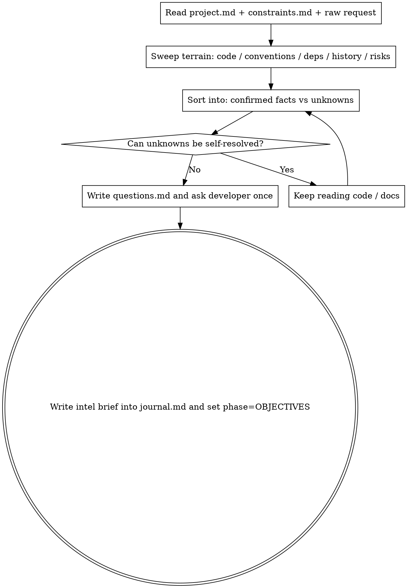

# Gathering Intel · Reconnaissance

**Military principle: going to war without reconnaissance is suicide.** Before setting objectives or making a plan, map the terrain: how the relevant code works, what conventions exist, what depends on what, where the risks are, and what remains unknown. The output of intel gathering is two lists: **confirmed facts** and **unknowns that must be clarified**.

**State this when you begin:** "I am using gathering-intel for reconnaissance."

## Relationship to `being-truthful`

`being-truthful` is the passive gate for "what to do once uncertainty appears." `gathering-intel` is the proactive sweep: scan the terrain systematically before uncertainty surprises you. Both forbid guessing.

## Recon Checklist (cite sources)

1. **Terrain (relevant code):** entry points, key modules, data flow, state storage. Cite `file:line`.
2. **Existing conventions:** naming, layering, testing, error handling, existing patterns to follow instead of inventing new ones.
3. **Dependencies and boundaries:** upstream / downstream systems, external services, config.
4. **History:** relevant commits, docs, and prior decisions in `journal.md`.
5. **Risk hotspots:** fragile edges, hidden coupling, performance / security-sensitive areas.
6. **Unknowns:** anything still unresolved after reading code and docs.

## Flow

## Question Discipline

- Batch the important questions and ask once instead of drip-feeding them.
- For each question, say why it blocks progress, what you already checked, and any viable options. Record them in `questions.md`.
- Large reconnaissance may use read-only subagents in parallel, but you still need to synthesize and verify the result yourself.

## Output

Write an **intel brief** into `journal.md`: a list of confirmed facts (each with a source) plus a list of unresolved questions. This is the factual foundation for `objectives` and `plan`.

## Red Flags

| Thought | Reality |
|------|------|
| "The request is clear enough; I can set objectives directly." | Objectives set without recon are often built on false assumptions. Sweep the terrain first. |
| "I more or less know how this code works." | "More or less" means not confirmed. Read it and cite it. |
| "I’ll remember the unknowns and resolve them while building." | Important unknowns need to be clarified now, or they contaminate every later step. |
