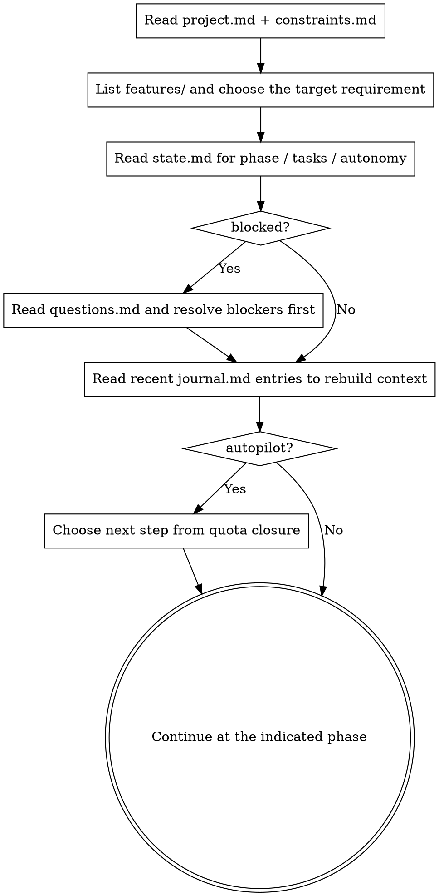

# State and Memory · Recoverable Across People and AIs

**Core principle: the process must live in files, not in chat context.** Chat is lossy; AIs get swapped; people hand work over. As long as `docs/sandtable/` exists, anyone can continue.

## Directory Layout (create in the target project root)

```text
docs/sandtable/
  project.md
  constraints.md
  lessons.md                 # global lesson ledger, accumulated across features (see triaging-feedback)
  features/
    <YYYY-MM-DD>-<slug>/
      prd.md
      tests.md
      plan.md
      state.md
      journal.md
      questions.md
      feedback.md            # acceptance feedback ledger (see triaging-feedback; exists only post-landing)
      rehearsals/
        mental-<n>.md
        redteam-<n>.md
        impl-<n>-<branch>.md
```

> Note: bugfix-collected raw logs are NOT committed (often contain secrets/PII); they land outside the repo / in a temp dir, and `feedback.md` keeps only excerpts + line numbers.
> FEEDBACK phase: after DONE, user acceptance feedback enters; defects go through bugfix root cause -> fix -> regression -> lesson, accumulating into the global `lessons.md`. FEEDBACK is human-in-the-loop; autopilot does not drive it.

Templates live in this plugin’s `templates/`.

## `state.md`: The Single Trusted Progress Record

`state.md` uses YAML frontmatter for machine-readable state and regular markdown for human-readable status:

```markdown
---
feature: 2026-06-01-user-login
phase: PLAN            # INTAKE|RECON|OBJECTIVES|TESTCASES|PLAN|MENTAL_REHEARSAL|REDTEAM|IMPL_REHEARSAL|EVALUATE|INTEGRATE|VERIFY|DONE|FEEDBACK
blocked: false
updated: 2026-06-01T23:00:00+08:00
tasks:
  - id: T1
    title: Login form component
    status: todo
  - id: T2
    title: Auth API integration
    status: todo
rehearsals:
  mental:  { runs: 0, last: none }
  redteam: { runs: 0, last: none }
  impl:    { runs: 0, last: none }
autonomy:
  mode: manual
  min_rounds: { mental: 3, redteam: 3, impl: 2 }
  min_agents_per_round: { mental: 3, redteam: 3, impl: 2 }
  completed_rounds: { mental: 0, redteam: 0, impl: 0 }
  last_decision: none
selected_impl: none
---
```

Rules:
- Update `state.md` after every action: `phase`, `tasks`, `updated`, and in autopilot also `autonomy.last_decision` and `autonomy.completed_rounds` when needed.
- If `blocked: true`, the main flow pauses and you must resolve `questions.md` first.
- `autonomy.mode` is the only authoritative switch for autonomous mode. Do not invent sibling flags.
- In autopilot, recovery logic is driven by `autonomy.*`, not by `rehearsals.*`.
- Manual `/sandtable-mental`, `/sandtable-redteam`, `/sandtable-live`, and `/sandtable-rehearse` still update `rehearsals.*`, but those manual runs do **not** count toward `autonomy.completed_rounds`.
- On rollback (anomaly -> fix), set `phase` back to the earliest stage that is no longer validated, and record why in `journal.md`; if in autopilot, refresh `autonomy.last_decision` too.
- If an old feature directory is missing the `autonomy` block, treat it explicitly as `manual`; do not infer autopilot state from `rehearsals.*`.

## `journal.md`: Append-Only Memory

Each entry should look like:

```text
## 2026-06-01 23:10 · [decision|Q&A|rehearsal|attack|anomaly|integration]
- Context: ...
- Content: ...
- Basis / source: file:line or developer reply
```

Never delete or rewrite history entries. Corrections are new entries.

## Resume Flow (the core of `/sandtable-resume`)



Do not reinvent already-recorded decisions when resuming. Only go back to `being-truthful` if you find a contradiction or a gap.

Autopilot continuation must follow this exact branch:
1. If `blocked=true`: resolve `questions.md` first.
1.5 **If `phase` ∈ {`DONE`, `FEEDBACK`} (post-landing)**: autopilot quota closure does **not** apply; always **resume by `phase`**. `FEEDBACK` is human-in-the-loop, autopilot does not drive it, and it must **not** be mis-routed back to `EVALUATE` just because the three quotas are met (advance manually via `/sandtable-bug`, `/sandtable-bugfix`).
2. If `autonomy.mode=autopilot` and `blocked=false` (and 1.5 did not match):
   - if `completed_rounds.mental < min_rounds.mental`, next is `MENTAL_REHEARSAL`
   - else if `completed_rounds.redteam < min_rounds.redteam`, next is `REDTEAM`
   - else if `completed_rounds.impl < min_rounds.impl`, next is `IMPL_REHEARSAL`
   - else next is `EVALUATE`
3. If `autonomy.mode=manual`, resume from `phase`.

## Red Flags

| Thought | Reality |
|------|------|
| "I can keep progress in my head." | You will be replaced or lose context. Write it into `state.md`. |
| "The journal is too verbose; I’ll skip it." | Without the journal, the next AI effectively starts from zero. |
| "I’ll edit an old journal entry to fix it." | History is append-only. Fixes are new entries. |
| "We’re blocked, but I’ll keep doing other parts." | `blocked=true` means the main flow stops. Resolve `questions.md` first. |
