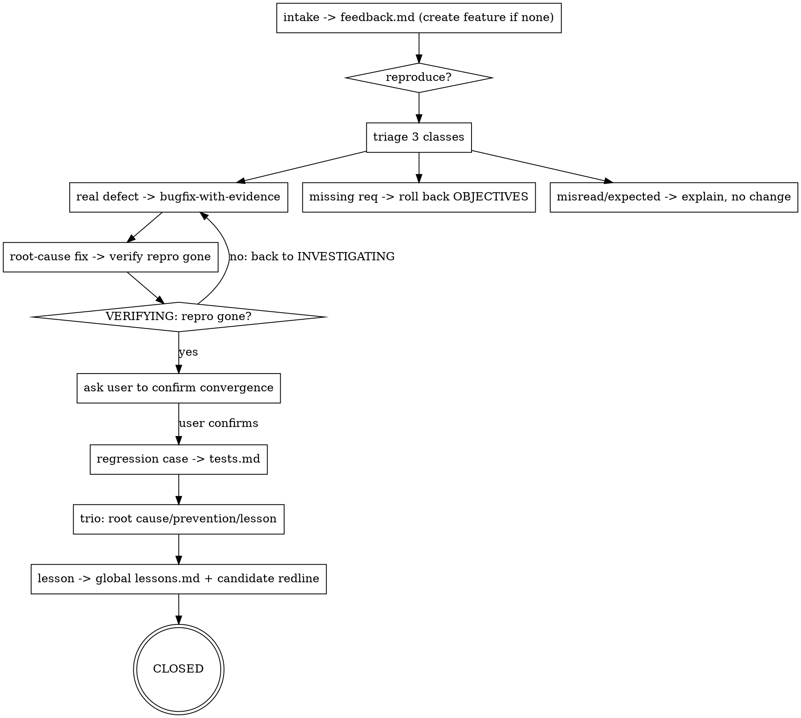

# Triaging Feedback · Turn escaped bugs into methodology hardening

**Core stance: every bug that escapes to acceptance = a rehearsal blind spot.** Fixing it must also answer "why didn't the three rehearsals catch it", turning the answer into a regression case + a lesson — so Sandtable feeds itself with its own bugs.

**Announce at start:** "I'm using triaging-feedback to triage acceptance feedback."

<HARD-GATE>
1. Incoming feedback MUST first be recorded in `docs/sandtable/features/<id>/feedback.md` (one entry each) before handling; no untracked verbal handling. **No-feature fallback**: if the reported code has no matching feature dir, first auto-create a lightweight feature `<date>-bugfix-<slug>` (minimal state/feedback), reusing sandtable-init idempotent logic, never overwriting.
2. **Triage into one of three classes**, with sourced conclusions (`file:line` or PRD item), never invented:
   - **Real defect**: behavior contradicts confirmed requirements → MUST route to `bugfix-with-evidence` for root cause; never skip root cause and patch directly.
   - **Missing requirement**: never covered originally → roll back to `OBJECTIVES`, amend PRD/tests via `writing-prd`/`writing-tests`, don't patch as a bug.
   - **Misunderstanding / expected**: behavior matches requirements or is a misread → explain with evidence, don't change code.
3. **Lifecycle**: each feedback carries an explicit state `OPEN → TRIAGED → INVESTIGATING(iterative) → ROOT_CAUSED → FIXING → VERIFYING → USER_CONFIRMED → CLOSED`; investigation is **iterative**, VERIFYING-not-passed bounces back to INVESTIGATING; **without the user confirming convergence, never set USER_CONFIRMED/CLOSED** (the agent must not self-declare "resolved" and close).
4. After a defect fix closes, you MUST produce: (a) a regression case appended to that feature's `tests.md` (no separate ledger); (b) the **closure trio** — root cause (causal chain + evidence), **prevention** (process/redline/checklist-level, not "be careful next time"), and **lesson** (one reusable takeaway); missing any → not CLOSED.
5. **Lesson accumulation**: on close, append the lesson to the global `docs/sandtable/lessons.md` (create from `templates/lessons.md` if absent), and propose a **candidate update** to `constraints.md` (new redline) / RECON checklist (new check); adoption is the developer's call — **never** edit `constraints.md` unilaterally.
</HARD-GATE>

## FEEDBACK is a human-in-the-loop phase

`autopilot` does **not** drive FEEDBACK (its mandated scope ends at `EVALUATE/DONE`, see `autonomous-orchestration`); FEEDBACK is entered only manually via `/sandtable-bug`, `/sandtable-bugfix`; "waiting for the user to confirm convergence" is a legitimate stopping point. On resume, `phase=FEEDBACK` is restored by phase, outside autopilot quota closure, and must not be mis-routed back to `EVALUATE`.

## Triage & lifecycle flow

## Relation to the state machine
- On intake, set `state.md` `phase` to `FEEDBACK` (after-action), refresh `updated`, append `[feedback]` to journal.
- When the fix touches code, roll back to `PLAN` (impl defect) or `OBJECTIVES` (missing req) for the shortest loop, then back to `VERIFY`, finally `FEEDBACK`/`DONE`.

## Red Flags
| Thought | Reality |
|---------|---------|
| "Small bug, just fix it" | Defects must go through root cause (bugfix-with-evidence), or you risk a surface fix. |
| "Fixed, close it" | No close without user-confirmed convergence; no prevention+lesson = wasted feedback. |
| "This is actually a missing req, I'll just add code" | Missing reqs roll back to OBJECTIVES to amend PRD/tests, not patched as bugs. |
| "Autopilot, just close the feedback too" | FEEDBACK is human-in-the-loop; autopilot doesn't drive it; wait for user confirmation. |

When done, load `skills/closing-the-loop/SKILL.md` for the turn close-out.
