<SUBAGENT-STOP>
If you were dispatched as a subagent for a concrete task (mental rehearsal / red-team attack / implementation rehearsal / review), skip this skill and execute the task prompt you were given directly.
</SUBAGENT-STOP>

# Sandtable · Wargame-Driven Development

Turn a one-line request or rough requirement into the feature the developer actually wants: logically closed, product-complete, and polished in the details. The method is a reinforcing loop: **plan -> rehearse -> find problems -> fix the plan -> rehearse again**.

> **Terminology:** "rehearsal" is the umbrella term here and includes three kinds: **mental rehearsal** (read-only reasoning), **red-team attack** (hostile subagents trying to break it), and **implementation rehearsal** (real code in isolated worktrees).

<EXTREMELY-IMPORTANT>
If there is even a 1% chance that a sub-skill applies to your current action, you must read and follow it. You may not rationalize yourself out of the process by saying "this is simple," "I’m just looking at code," or "this is only a question." Violating the letter violates the spirit.
</EXTREMELY-IMPORTANT>

## Priority

1. **Explicit user instruction** (highest priority) - if the user says "skip the process / just change it," obey, but warn about the risk.
2. **Sandtable methodology** - overrides default behavior.
3. **Default system behavior** - lowest priority.

## Core Loop (State Machine)

```dot
digraph sandtable {
  rankdir=LR;
  INTAKE [shape=box label="INTAKE\nTake the task"];
  RECON [shape=box label="RECON\nReconnaissance"];
  OBJ [shape=box label="OBJECTIVES\nGoals + red lines"];
  TESTS [shape=box label="TESTCASES\nCalibration targets"];
  PLAN [shape=box label="PLAN\nOperational plan"];
  MENTAL [shape=box label="Mental rehearsal"];
  RED [shape=box label="Red-team attack (optional)"];
  IMPL [shape=box label="Implementation rehearsal"];
  EVAL [shape=diamond label="All clear?"];
  INTEGRATE [shape=box label="INTEGRATE\nLand the change"];
  VERIFY [shape=box];
  DONE [shape=doublecircle];
  FEEDBACK [shape=box label="FEEDBACK\nPost-landing loop (re-entrant)"];
  FIX [shape=box label="Verify personally -> ask developer -> fix objectives / plan"];

  INTAKE -> RECON -> OBJ -> TESTS -> PLAN -> MENTAL -> RED -> IMPL -> EVAL;
  MENTAL -> FIX [label="ANOMALY"];
  RED -> FIX [label="BREACH"];
  IMPL -> FIX [label="ANOMALY"];
  EVAL -> FIX [label="No"];
  EVAL -> INTEGRATE [label="Yes, debrief and choose"];
  FIX -> OBJ [label="Run again"];
  INTEGRATE -> VERIFY -> DONE;
  DONE -> FEEDBACK [label="user acceptance feedback"];
  FEEDBACK -> FIX [label="defect -> root cause / rehearse"];
}
```

| Phase | Military metaphor | Purpose | Skill to load | Command |
|------|------|--------|-------------|------|
| INTAKE | Take the task | Capture the raw request and create the feature directory | `state-and-memory` | `/sandtable-start` |
| RECON | Reconnaissance | Gather code and doc intel, list unknowns, ask questions | `gathering-intel` | `/sandtable-recon` |
| OBJECTIVES | Commander’s intent | Define goals, MUST / MUST-NOT, red lines, acceptance criteria | `writing-prd` | `/sandtable-objectives` |
| TESTCASES | Calibration targets | Turn success into black-box cases that prove understanding | `writing-tests` | (folded into objectives, iterate via `/sandtable-refine`) |
| PLAN | Operational plan | Write a concrete, executable change plan | `writing-plan` | `/sandtable-plan` |
| (Any phase) | Adjust deployment | Revise the objective / cases / plan based on feedback | `writing-prd` / `writing-tests` / `writing-plan` | `/sandtable-refine` |
| MENTAL_REHEARSAL | Map exercise | Read-only reasoning over logical closure | `mental-rehearsal` | `/sandtable-mental` |
| REDTEAM | Red-team attack | Hostile subagents try to break it | `red-team-wargame` | `/sandtable-redteam` |
| IMPL_REHEARSAL | Field exercise | Real code in isolated worktrees | `implementation-rehearsal` | `/sandtable-live` |
| EVALUATE | After-action review | Score implementations and choose the best | `evaluating-rehearsals` | `/sandtable-debrief` |
| INTEGRATE | Integrate | Land the selected implementation | - | - |
| VERIFY | Confirm results | Run validation and confirm success criteria | `being-truthful` | - |
| FEEDBACK | After-action | Intake acceptance feedback, triage, route defects to bugfix root cause (logs at 100%), regression + lesson | `triaging-feedback` / `bugfix-with-evidence` | `/sandtable-bug` `/sandtable-bugfix` |
| (Any time) | Status / resume | Inspect state or recover after interruption | `state-and-memory` | `/sandtable-status` `/sandtable-resume` |

Each phase has its own command and can be triggered independently and repeatedly. `/sandtable-start` owns only the first five steps; `/sandtable-rehearse` owns only rehearsals plus debrief, not intake; if the developer wants uninterrupted progression, use `/sandtable-autopilot`.

Additional notes:
- `/sandtable-start`: only `INTAKE -> RECON -> OBJECTIVES -> TESTCASES -> PLAN`
- `/sandtable-rehearse`: only `MENTAL_REHEARSAL -> REDTEAM -> IMPL_REHEARSAL -> EVALUATE`
- `/sandtable-autopilot`: explicitly enables autonomous progression for the current run, from request intake through debrief
- **Post-landing loop (FEEDBACK)**: after DONE, user acceptance feedback enters here, driven manually by `/sandtable-bug` (intake & triage) and `/sandtable-bugfix` (evidence-driven root cause, **must be confirmed by logs at 100%**); after the fix, produce a regression case + the root-cause/prevention/lesson trio, accumulating the lesson into the global `lessons.md` to feed future RECON / red team / PRD. **FEEDBACK is human-in-the-loop; autopilot does not drive it** (autopilot scope ends at EVALUATE/DONE).

## The Three Questions the Rehearsals Ask

- **Mental rehearsal:** Does the logic close?
- **Red-team attack:** Can it be broken?
- **Implementation rehearsal:** Can we actually build it correctly?

## Two Iron Laws of Rehearsal

1. **If any rehearsal finds something that diverges from the plan, is unexpected, or was previously unnoticed, stop immediately and report it.** Never "fix it quickly and keep going."
2. **Rehearsals run in isolated subagents and may be parallelized.** Implementation rehearsals must each use an independent git worktree / branch.

## Anomaly -> Fix -> Rehearse Again (The Heart of the System)

Whenever any rehearsal returns `ANOMALY_FOUND` / `BREACH_FOUND` (or the debrief finds something unexpected):
1. The main agent **verifies it personally** by reading the relevant code / docs instead of trusting subagents blindly.
2. Provide a **reasonable fix**; if uncertainty remains or it is a product decision, **ask the developer** and record the question in `questions.md`.
3. Write the clarified result back into `prd.md` / `tests.md` / `plan.md`, and append the decision to `journal.md`.
4. **Rehearse again** until the line holds. Then use `evaluating-rehearsals` to score the implementation rehearsals and select the strongest one.

## Close the Loop (end of Sandtable work steps)

Only when this turn is a **Sandtable work step** (positive trigger in `closing-the-loop` FR8), load `skills/closing-the-loop/SKILL.md` and output the close block. **Do not** close for non-Sandtable tasks (e.g. typo fixes), even if `docs/sandtable/` was read. Use AskQuestion for manual multi-branch; use status bulletin + resume in-command for autopilot non-blocked.

## Trigger Rules (Red Flags = You Are Rationalizing)

| Thought | Reality |
|------|------|
| "This requirement is too simple to need the process." | A simple requirement may have a short process, but it still needs the process. |
| "I’ll just change the code and see." | Write or confirm the PRD and plan first, rehearse, then change code. |
| "I think this detail probably..." | Do not think. Read code / docs / ask the developer; see `being-truthful`. |
| "The rehearsal found a small issue; I’ll patch it and keep going." | Stop and report immediately. Small issues are often signs of larger logical holes. |
| "Running multiple implementation rehearsals in one worktree is faster." | They will contaminate each other. Each implementation rehearsal gets its own worktree. |
| "I already know this workflow; I don’t need to read the skill." | Skills evolve. Read the current version on demand. |
| "Adding a fallback or extra flexibility would be safer." | Do not add unrequested fallback logic or side quests. Keep changes surgical. |

## Relationship to Existing Methodologies

Sandtable absorbs Karpathy’s four principles (no guessing, minimalism, surgical changes, goal-driven work) and the subagent orchestration ideas from superpowers, then adds **three kinds of rehearsal (mental / red-team / implementation) + a persistent state machine + an anomaly-driven fix loop**. If a project already has superpowers installed, you may still reuse its `test-driven-development`, `requesting-code-review`, and `finishing-a-development-branch` skills during `INTEGRATE` / `VERIFY`.
