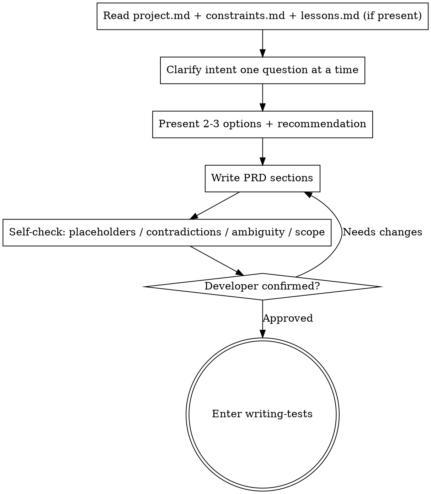

# Writing the PRD · Goals, Requirements, Acceptance, Red Lines

The PRD is the factual foundation of the requirement. It answers: **why are we doing this, what counts as success, what absolutely must happen, and what absolutely must not happen.** Implementation detail belongs in the plan, not here.

**State this when you begin:** "I am using writing-prd to solidify the requirement into a PRD."

## HARD GATE

<HARD-GATE>
You must perform reconnaissance (`gathering-intel`) before writing the PRD. Any unclear or missing requirement point must be resolved through `being-truthful`; do not invent requirements inside the PRD. After the PRD is written, the developer must confirm it before you move to TESTCASES.
</HARD-GATE>

## Flow

## Required PRD Sections

1. **Goal**: one sentence that states what the requirement achieves for the user and how it relates to `project.md`.
2. **Background and current state**: factual context about relevant modules / code, with `file:line`.
3. **User stories / scenarios**: who is doing what, in which scenario, and why.
4. **Functional requirements**: numbered, traceable items, each with a source.
5. **Acceptance criteria (abstract success definition)**: keep this section abstract; concrete rehearsal-ready scenarios belong in `tests.md`.
6. **MUST**: hard requirements.
7. **MUST NOT**: boundaries and red lines, including no fallback logic and no side quests; inherit `constraints.md`.
8. **Non-goals / out of scope**: explicitly cut items (YAGNI).
9. **Open questions**: point to `questions.md`.

## Option Exploration

Before locking the requirements, present **2-3 different approaches**, list the tradeoffs, and recommend one with reasons. Do not silently choose.

## Self-Check

| Check | Fix |
|------|------|
| Placeholders (`TBD`, "later", "probably") | Clarify first or move to `questions.md` |
| Internal contradiction | Rewrite until consistent |
| Ambiguous wording | Choose a clear interpretation and write it explicitly, or ask |
| Scope too large | Split into multiple requirements |
| Acceptance not verifiable | Rewrite as measurable conditions |

## Red Flags

| Thought | Reality |
|------|------|
| "The requirement is obvious; I can write the plan directly." | Without a PRD and acceptance criteria, rehearsals cannot judge correctness. |
| "I’ll fill missing PRD details with common sense." | Missing requirements must be asked, not invented. |
| "MUST NOT is optional." | Without red lines, rehearsals cannot detect scope violations. |

After the PRD is confirmed, update `state.md` to `phase=TESTCASES` and load `writing-tests`.

## Feature Addendum: Execute Already-Selected Paths and Persist PRD Evidence

- Priority: real blockers (`blocked=true`, missing product intent, permission, login, external resource, or key fact) come first and require `questions.md`, `blocked=true`, and a question; the PRD confirmation gate comes next; only then execute the user's selected path.
- If the user already selected the next step via AskQuestion or clearly wrote “confirm and continue / continue with X / choose X”, and there is no real blocker, the agent must execute that step in the same turn. Do not ask again and do not merely print the same copy-paste command.
- If the selection confirms the PRD, persist traceable PRD confirmation evidence to `state.md` or `journal.md` before or while entering TESTCASES/PLAN/MENTAL/REDTEAM/IMPL/rehearse/live/debrief. AskQuestion evidence records answer id or `source: askquestion:<id>` plus option text and confirmation time; natural-language evidence records quoted user text, confirmation time, and user-message source.
- `/sandtable-start` still stops after writing an unconfirmed PRD. But if AskQuestion or natural language in the same turn already confirms the PRD and asks to continue, persist the evidence and continue directly to TESTCASES; the old command boundary must not override an already selected path.
- `/sandtable-objectives`, `/sandtable-refine`, and `/sandtable-resume` receiving “PRD confirmed, continue to tests.md” must record the natural-language evidence and load `writing-tests` directly. With `phase=OBJECTIVES` and an existing `prd.md`, do not re-enter `writing-prd`.
- `/sandtable-plan`, `writing-tests`, and `writing-plan` must check PRD confirmation first. If the same message confirms the PRD and triggers tests/plan writing, persist evidence before or while writing. Missing `tests.md` with confirmed PRD goes back to TESTCASES; unconfirmed PRD stops at confirmation.
- Refining the PRD still edits the PRD. Refining tests/plan or continuing to rehearsal requires PRD confirmation first. If `blocked=true` and the user also says continue, blocker wins.
- Full closeout has two profiles: if no path is selected, include recommendation and copy-paste templates; if a path was selected and executed, report result, current phase, and next recommendation only. Any template must point to the next stage, not repeat the already executed selection.
