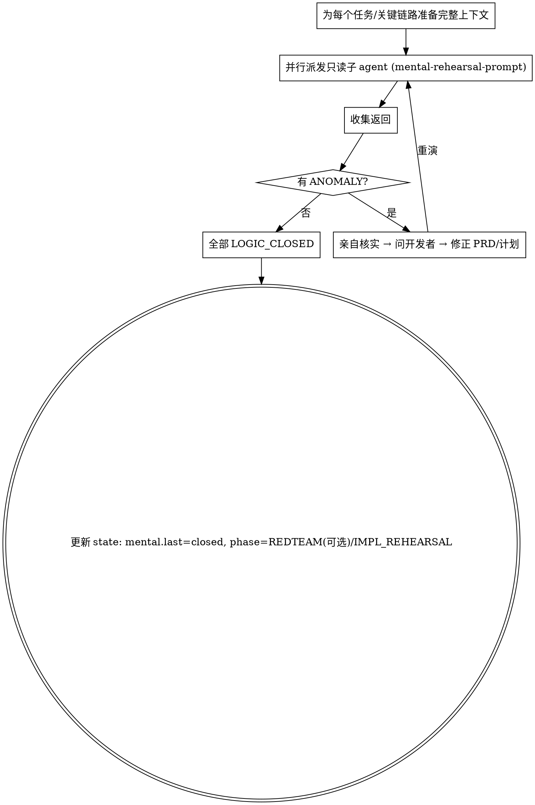

# 头脑预演 · 逻辑推演（只读，不改代码）

**核心：在不写一行代码的前提下，把整条逻辑链路从头到尾推一遍，验证它真的闭环、通畅、没有漏洞、没有意料之外的影响。** 这是用思考成本提前暴露问题，比实现预演更便宜。

**开始时声明：** "我在用 mental-rehearsal 做头脑预演。"

## 它做什么 / 不做什么

- **做**：读计划、PRD、相关代码和文档；按真实调用路径逐步推演数据流、控制流、状态变化、边界与异常路径；核对是否违反 MUST/MUST-NOT；判断逻辑是否闭环。
- **不做**：不改任何代码、不创建文件、不跑会产生副作用的命令。纯只读推理。
- **不将就、不兜底、不节外生枝**：遵循 Karpathy 原则。发现"计划没覆盖的情况"不要自己脑补一个兜底方案——那是 ANOMALY，要上报。

## 两条铁律

1. **只要发现与计划不符、意料之外、或之前没注意到的事 → 立即终止推演，返回 `ANOMALY_FOUND`。** 不要"假设它是这样"继续推。不确定本身就是 anomaly。
2. **在隔离子 agent 中进行，可并行派发多个**（不同视角/不同子模块各一个，或多个同任务交叉验证）。

## 编排（主 agent 做的事）

- 主 agent **不要轻信**子 agent 的"逻辑闭环"结论：抽查它给的推理链与引用是否真实存在。
- 每轮把结果写入 `rehearsals/mental-<n>.md`，并在 `journal.md` 追加一条。

## 子 agent 返回格式（强制）

- `LOGIC_CLOSED` — 推理链完整、闭环、无漏洞。附：①端到端逻辑链（步骤+引用 file:line）②已检查的边界/异常路径 ③与 MUST/MUST-NOT 的核对结论。
- `ANOMALY_FOUND` — 附：具体偏差是什么、在计划/代码的哪一处、为什么是问题、影响范围、它需要哪种澄清。
- 子 agent 派发模板见 `./mental-rehearsal-prompt.md`。

## Red Flags

| 念头 | 现实 |
|------|------|
| "推到一半发现计划漏了个情况，我补个兜底继续" | 立即 ANOMALY 上报。不脑补。 |
| "这条异常路径大概不会走到" | 大概=没确认。要么确认，要么上报。 |
| "子 agent 说闭环了，那就过" | 抽查它的引用与推理。不轻信。 |
| "一个子 agent 推所有链路更省" | 拆分独立链路并行，视角更聚焦。 |
