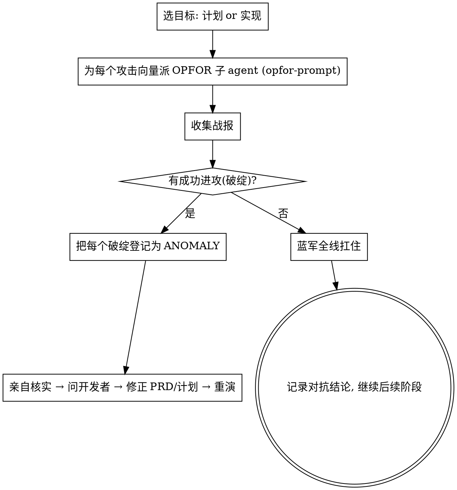

# 红蓝对抗 · OPFOR Wargame（让"敌军"来击溃你的计划）

**军事原则：你想不到的破绽，对手会替你找到。** 普通评审是"友军检查"，容易手下留情；红蓝对抗是**敌我对抗**——红军（OPFOR）唯一使命就是**击溃**当前计划/实现。蓝军（你的方案）必须扛住所有进攻才算合格。**每一次成功的进攻 = 一个 ANOMALY，喂给修正循环。**

**开始时声明：** "我在用 red-team-wargame 发起红蓝对抗。"

## 什么时候打

- **对计划打**：头脑预演后、实现预演前。攻击"计划本身"——逻辑、假设、覆盖面。
- **对实现打**：实现预演 DONE 后、复盘择优前。攻击"做出来的代码"——边界、并发、回归、越界。
- 可任选其一或都打。脑洞越大的需求越该打。

## 红军的进攻向量（OPFOR 攻击面）

给每个红军子 agent 指定一个或多个攻击向量，逼它往死里打：

| 进攻向量 | 红军要找的"杀招" |
|---------|------------------|
| **反例攻击** | 构造一个让方案给出错误结果/崩溃的具体输入或场景 |
| **边界突袭** | 空/超大/并发/乱序/重复/超时/网络抖动等极端条件 |
| **假设斩首** | 找出计划里没说出口的隐含假设，证明它不成立 |
| **侧翼包抄** | 隐藏耦合：改动会波及哪个没人注意的上下游 |
| **红线渗透** | 找出方案在某条路径下悄悄违反了某条 MUST / MUST-NOT |
| **回归伏击** | 这个改动会打破哪个现有功能/测试 |
| **范围蔓延** | 揪出未被要求的兜底/灵活性/节外生枝（越界即破绽） |
| **需求背离** | 做的东西其实没满足 PRD 的某条验收标准 |

## 编排（主 agent = 蓝军指挥）

## 裁决规则（防止"假胜利"）

- 红军必须**给出可复现的杀招**（具体输入/场景/步骤 + 预期错误），空泛的"可能有风险"不算成功进攻。
- 主 agent（蓝军）**亲自核实每个杀招是否真成立**，不轻信红军也不轻信蓝军。
- 红军"没找到破绽"不等于安全——记录它打了哪些向量、为何没破，作为信心依据。
- 每轮对抗写入 `rehearsals/redteam-<n>.md`，journal 追加。state 的 `rehearsals.redteam` 计数。

## 三类推演的位置

红蓝对抗是"对抗式推演"，和头脑预演、实现预演三位一体：
- 头脑预演问"逻辑通不通"；
- 红蓝对抗问"能不能被打破"；
- 实现预演问"做出来对不对"。
任一暴露异常，都走同一条 **核实 → 问开发者 → 修正 → 重演** 循环。

## Red Flags

| 念头 | 现实 |
|------|------|
| "红军没找到大问题，差不多得了" | 让红军换个攻击向量再打一轮，尤其红线渗透/侧翼包抄。 |
| "红军说有风险，但没给复现" | 不算破绽。要求可复现杀招，否则驳回。 |
| "这破绽很小，记下来以后改" | 小破绽常是大漏洞的入口。登记为 anomaly，进修正循环。 |
| "蓝军自己说扛住了" | 主 agent 亲自核实杀招是否成立。 |

子 agent 派发模板见 `./opfor-prompt.md`。
