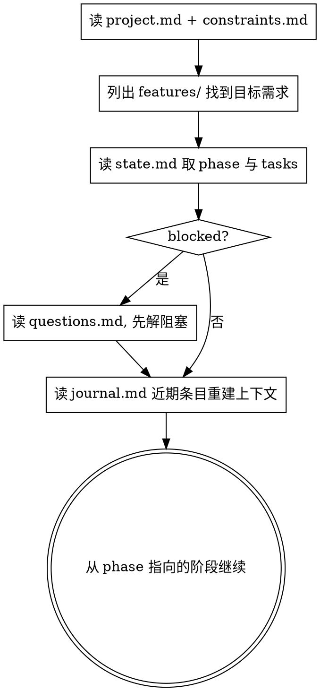

# 状态与记忆 · 换人换 AI 可续

**核心原则：过程不靠对话上下文，靠文件。** 对话会丢、AI 会换、人会换；只要 `docs/sandtable/` 在，任何人/AI 都能接着干。

## 目录结构（在目标项目根创建）

```
docs/sandtable/
  project.md                       # 北极星: 项目目标/背景/范围 (全局, 唯一)
  constraints.md                   # 全局红线: MUST / MUST-NOT (全局, 唯一)
  features/
    <YYYY-MM-DD>-<slug>/           # 一个需求一个目录
      prd.md                       # 需求/目标/验收/红线 (见 writing-prd)
      plan.md                      # 改动计划, 任务带 checkbox (见 writing-plan)
      state.md                     # 状态机: 当前阶段 + 任务状态 (本 skill)
      journal.md                   # 追加式记忆: 决策/问答/推演结果, 只增不改
      questions.md                 # 待开发者澄清的阻塞问题
      rehearsals/
        mental-<n>.md              # 头脑预演报告
        redteam-<n>.md             # 红蓝对抗战报
        impl-<n>-<branch>.md       # 实现预演报告 + 评分
```

模板见本插件 `templates/`，可直接拷贝改名。

## state.md：唯一可信的进度

`state.md` 用 YAML frontmatter 存机器可读状态，正文存人类可读摘要：

```markdown
---
feature: 2026-06-01-user-login
phase: PLAN            # INTAKE|RECON|OBJECTIVES|PLAN|MENTAL_REHEARSAL|REDTEAM|IMPL_REHEARSAL|EVALUATE|INTEGRATE|VERIFY|DONE
blocked: false         # true 时必须在 questions.md 有对应阻塞问题
updated: 2026-06-01T23:00:00+08:00
tasks:
  - id: T1
    title: 登录表单组件
    status: todo       # todo|doing|rehearsed|integrated|verified|done
  - id: T2
    title: 鉴权接口对接
    status: todo
rehearsals:
  mental:  { runs: 0, last: none }     # none|closed|anomaly
  redteam: { runs: 0, last: none }     # none|held|breach
  impl:    { runs: 0, last: none }     # none|done|anomaly|blocked
---

## 当前进展
（一两句话：现在在哪一步，下一步要做什么）

## 关键决策（最近）
（指向 journal.md 的近期要点）
```

**规则：**
- 每完成一个动作就更新 `state.md` 的 `phase`/`tasks`/`updated`。
- `blocked: true` 时，主流程暂停，必须先解决 `questions.md` 里的阻塞问题。
- 状态回退（异常→修正）时，把 `phase` 改回 `OBJECTIVES` 或 `PLAN`，并在 journal 记录原因。

## journal.md：只增不改的记忆

每条记录格式：
```
## 2026-06-01 23:10 · [决策|问答|推演|对抗|异常|集成]
- 背景: ...
- 内容: ...
- 依据/来源: file:line 或 开发者答复
```
**永远不要删改历史条目**——这是换人换 AI 后重建理解的依据。

## 恢复流程（/sandtable-resume 的内核）



恢复时**不要重新发明已有决策**——journal 里记过的就按记的来；只在发现矛盾或缺失时才回到 `being-truthful` 去澄清。

## Red Flags

| 念头 | 现实 |
|------|------|
| "进度我记在脑子里就行" | 你会被换掉/上下文会丢。写进 state.md。 |
| "journal 太啰嗦，跳过" | 没有 journal，下一个 AI 等于从零开始。 |
| "直接改 journal 旧条目修正一下" | 历史只增不改，修正用新条目。 |
| "blocked 了我先往下做别的" | blocked=主流程停。先解 questions.md。 |
