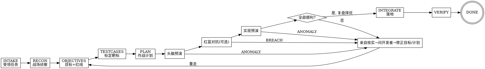

<SUBAGENT-STOP>
若你是被派发来执行某个具体任务（头脑预演 / 红蓝对抗 / 实现预演 / 评审）的子 agent，跳过本技能，直接执行你收到的任务 prompt。
</SUBAGENT-STOP>

# Sandtable · 沙盘推演驱动开发

把一句简单描述或一份粗糙需求，做成开发者**真正想要**的功能——逻辑闭环、产品闭环、细节完美。手段是一个不断加固的循环：**计划 → 推演 → 发现问题 → 修正计划 → 再推演**。

> **术语**：本文"推演"是统称，包含三类——**头脑预演**（只读推逻辑）、**红蓝对抗**（红军专攻找破绽）、**实现预演**（隔离 worktree 真改代码）。

<EXTREMELY-IMPORTANT>
只要有 1% 的可能某个 sub-skill 适用于你当前的动作，你就必须读取并遵循它。你无法用"这次很简单""我先看看代码""这只是个问题"把自己合理化出流程之外。违反规则的字面，就是违反规则的精神。
</EXTREMELY-IMPORTANT>

## 优先级

1. **用户的显式指令**（本条最高）——用户说"跳过流程/直接改"，照做，但提醒风险。
2. **Sandtable 方法论**——覆盖默认行为。
3. **默认系统行为**——最低。

## 核心闭环（状态机）

| 阶段(phase) | 军事隐喻 | 做什么 | 加载的 skill | 命令 |
|------|------|--------|-------------|------|
| INTAKE | 受领任务 | 捕获原始需求（一句话/产品文档），建目录 | `state-and-memory` | `/sandtable-start` |
| RECON | 战场侦察 | 主动收集代码/文档情报，列未知，提问 | `gathering-intel` | `/sandtable-recon` |
| OBJECTIVES | 指挥官意图 | 定目标、MUST/MUST-NOT、红线、验收 | `writing-prd` | `/sandtable-objectives` |
| TESTCASES | 标定靶标 | 把成功定义具体化为黑盒用例,检验理解 | `writing-tests` | （并入 /objectives, /refine 迭代）|
| PLAN | 作战计划 | 写细到可执行的改动计划 | `writing-plan` | `/sandtable-plan` |
| （任意阶段）| 调整部署 | 据反馈反复修改/重制目标/用例或计划 | `writing-prd`/`writing-tests`/`writing-plan` | `/sandtable-refine` |
| MENTAL_REHEARSAL | 图上作业 | 只读子 agent 推演逻辑闭环 | `mental-rehearsal` | `/sandtable-mental` |
| REDTEAM | 红蓝对抗 | 红军子 agent 专攻找破绽（可选，强烈推荐）| `red-team-wargame` | `/sandtable-redteam` |
| IMPL_REHEARSAL | 实兵演习 | 子 agent 在隔离 worktree 真改代码 | `implementation-rehearsal` | `/sandtable-live` |
| EVALUATE | 战损复盘 | 全部顺利则打分择优 | `evaluating-rehearsals` | `/sandtable-debrief` |
| INTEGRATE | 落地 | 把选定实现落到主分支 | — | — |
| VERIFY | 战果确认 | 跑测试/验收，确认成功标准 | `being-truthful` | — |
| （随时）| 战报/接防 | 看状态 / 新 AI 重获记忆继续 | `state-and-memory` | `/sandtable-status` `/sandtable-resume` |

每个阶段都有独立命令，可单独触发、反复迭代，无需一次跑完。`/sandtable-start` 编排前五步，`/sandtable-rehearse` 串起三类推演 + 复盘。

## 三类推演各问一个问题

- **头脑预演**：逻辑通不通？（只读推演整条链路是否闭环）
- **红蓝对抗**：能不能被打破？（红军唯一使命是击溃方案）
- **实现预演**：做出来对不对？（隔离 worktree 真打一遍）

## 推演铁律（两条，三类推演通用）

1. **任一推演只要发现与计划不符、意料之外、或之前没注意到的事，立即终止并上报。** 禁止"顺手改一下继续跑"。这种发现恰恰是流程的价值所在。
2. **推演在隔离子 agent 中进行，可并行多个。** 其中实现预演必须各自独立 git worktree/分支。

## 异常 → 修正 → 重演（系统的心脏）

只要任何推演返回 `ANOMALY_FOUND` / `BREACH_FOUND`（或复盘发现意料之外）：
1. 主 agent **亲自核实**（读相关代码/文档，不轻信子 agent），用客观逻辑判断。
2. 给出**合理方案**；若仍不确定或属于产品决策，**向开发者提问/索要补充**，记入 `questions.md`。
3. 把澄清结论写回 `prd.md` / `tests.md` / `plan.md`，并在 `journal.md` 追加决策记录。
4. **重新推演**，循环直到全部顺利。之后用 `evaluating-rehearsals` 给各实现预演打分，选最高的落地。

## 触发规则（Red Flags = 你正在合理化）

| 念头 | 现实 |
|------|------|
| "这个需求太简单，不用走流程" | 简单需求流程可以很短，但必须走。 |
| "我先直接改代码看看" | 先写/确认 PRD 与计划，再推演，再改。 |
| "这个细节我猜应该是…" | 不猜。读代码/文档/问开发者，见 `being-truthful`。 |
| "推演发现点小问题，我顺手修了继续" | 立即终止上报。小问题常是逻辑漏洞的征兆。 |
| "在一个工作区跑多个实现预演更快" | 会互相污染。每个实现预演独立 worktree。 |
| "我记得这套流程，不用读 skill" | skill 会演进，按需读当前版本。 |
| "加个兜底/灵活性更稳" | 不做未要求的兜底，不节外生枝（外科手术式改动）。 |

## 与既有方法论的关系

Sandtable 吸收了 Karpathy 的四原则（不猜测、极简、外科手术式、目标驱动）与 superpowers 的子 agent 编排思想，新增了**三类推演（头脑预演/红蓝对抗/实现预演）+ 持久状态机 + 异常驱动的修正循环**。若项目已装 superpowers，可在 INTEGRATE/VERIFY 阶段复用其 `test-driven-development`、`requesting-code-review`、`finishing-a-development-branch`。
